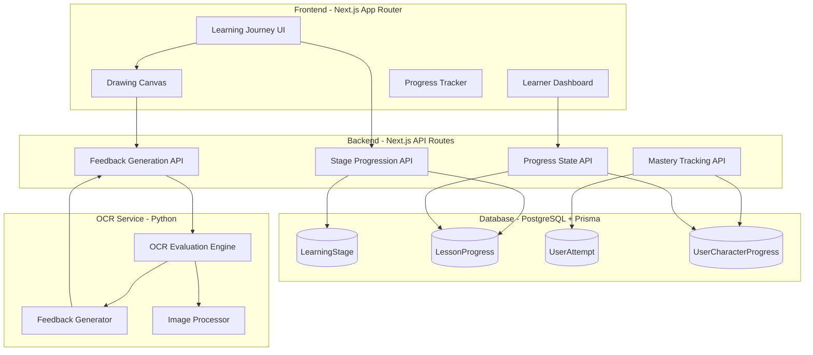
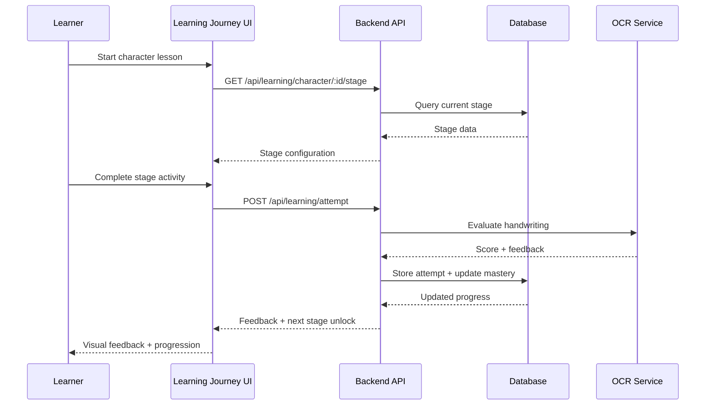
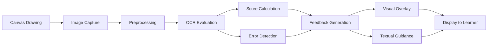

# Design Document: Adaptive Didactic Learning System - Phase 1 MVP

## Overview

This design document specifies the technical architecture for Phase 1 (MVP) of the Adaptive Didactic Learning System. Phase 1 focuses on building the core learning engine that transforms Uruziga from a content delivery platform into an evidence-based adaptive learning system.

### Phase 1 Scope

Phase 1 implements **4 core requirements** that form the foundation of the adaptive learning system:

1. **Requirement 1**: Eight-Stage Scaffolding System
2. **Requirement 2**: Competency-Based Mastery Tracking
3. **Requirement 3**: Immediate Feedback Loop with OCR Integration
4. **Requirement 14**: Learning Journey UI Transformation

### Design Principles

- **Incremental Enhancement**: Build on existing Prisma schema without breaking changes
- **Backward Compatibility**: Preserve existing user progress data
- **Extensibility**: Design for future phases (spaced repetition, adaptive paths, gamification)
- **Performance**: Maintain <2s dashboard load, <500ms OCR feedback
- **Mobile-First**: Responsive design from the start

### Success Criteria

- Learners progress through 8 distinct learning stages per character
- Mastery metrics accurately reflect competency across multiple dimensions
- OCR feedback delivered in <500ms with actionable guidance
- Learning journey UI provides cohesive, engaging progression experience
- Zero data loss during schema migration

## Architecture

### High-Level System Architecture



### Data Flow



## Components and Interfaces

### 1. Eight-Stage Scaffolding System

#### Stage Definitions

The system implements 8 sequential learning stages for each character:

| Stage | Name | Mastery Threshold | Primary Activity | Duration (min) |
|-------|------|-------------------|------------------|----------------|
| 1 | Recognition | 80% | Visual identification | 2-3 |
| 2 | Identification | 80% | Multiple choice selection | 2-3 |
| 3 | Tracing | 85% | Guided tracing over reference | 3-4 |
| 4 | Guided Writing | 85% | Writing with stroke hints | 4-5 |
| 5 | Independent Writing | 90% | Freehand writing | 5-6 |
| 6 | Word Formation | 85% | Character in word context | 4-5 |
| 7 | Sentence Formation | 85% | Character in sentence context | 5-6 |
| 8 | Cultural Application | 75% | Cultural context engagement | 3-4 |


#### Stage Progression Logic

```typescript
// Stage progression rules
interface StageProgressionRule {
  currentStage: LearningStageType;
  nextStage: LearningStageType | null;
  unlockCondition: {
    masteryScore: number;
    minAttempts: number;
    accuracyRate: number;
  };
}

const STAGE_PROGRESSION: StageProgressionRule[] = [
  {
    currentStage: 'RECOGNITION',
    nextStage: 'IDENTIFICATION',
    unlockCondition: { masteryScore: 80, minAttempts: 3, accuracyRate: 0.8 }
  },
  {
    currentStage: 'IDENTIFICATION',
    nextStage: 'TRACING',
    unlockCondition: { masteryScore: 80, minAttempts: 3, accuracyRate: 0.8 }
  },
  {
    currentStage: 'TRACING',
    nextStage: 'GUIDED_WRITING',
    unlockCondition: { masteryScore: 85, minAttempts: 5, accuracyRate: 0.85 }
  },
  {
    currentStage: 'GUIDED_WRITING',
    nextStage: 'INDEPENDENT_WRITING',
    unlockCondition: { masteryScore: 85, minAttempts: 5, accuracyRate: 0.85 }
  },
  {
    currentStage: 'INDEPENDENT_WRITING',
    nextStage: 'WORD_FORMATION',
    unlockCondition: { masteryScore: 90, minAttempts: 8, accuracyRate: 0.9 }
  },
  {
    currentStage: 'WORD_FORMATION',
    nextStage: 'SENTENCE_FORMATION',
    unlockCondition: { masteryScore: 85, minAttempts: 5, accuracyRate: 0.85 }
  },
  {
    currentStage: 'SENTENCE_FORMATION',
    nextStage: 'CULTURAL_APPLICATION',
    unlockCondition: { masteryScore: 85, minAttempts: 5, accuracyRate: 0.85 }
  },
  {
    currentStage: 'CULTURAL_APPLICATION',
    nextStage: null, // Final stage
    unlockCondition: { masteryScore: 75, minAttempts: 3, accuracyRate: 0.75 }
  }
];
```

#### Stage Component Architecture

```typescript
// Stage-specific interaction components
interface StageComponent {
  type: LearningStageType;
  component: React.ComponentType<StageProps>;
  interactionType: 'click' | 'drag' | 'draw' | 'text' | 'audio';
  validationRules: ValidationRule[];
}

const STAGE_COMPONENTS: StageComponent[] = [
  {
    type: 'RECOGNITION',
    component: RecognitionStage,
    interactionType: 'click',
    validationRules: [{ type: 'selection', minCorrect: 3 }]
  },
  {
    type: 'IDENTIFICATION',
    component: IdentificationStage,
    interactionType: 'drag',
    validationRules: [{ type: 'matching', accuracy: 0.8 }]
  },
  {
    type: 'TRACING',
    component: TracingStage,
    interactionType: 'draw',
    validationRules: [{ type: 'ocr', minScore: 85 }]
  },
  // ... additional stages
];
```


### 2. Competency-Based Mastery Tracking

#### Mastery Metrics

The system tracks 6 dimensions of competency:

```typescript
interface MasteryMetrics {
  // Core metrics
  masteryScore: number;        // 0-100 composite score
  accuracyRate: number;         // Percentage of correct attempts
  attemptCount: number;         // Total attempts for this character
  timeSpent: number;            // Total seconds spent learning
  
  // Derived metrics
  confidenceScore: number;      // Consistency across attempts (0-100)
  completionStatus: CompletionStatus; // NOT_STARTED | IN_PROGRESS | LEARNED | MASTERED
  
  // Stage-specific data
  stageScores: Record<LearningStageType, number>;
  stageAttempts: Record<LearningStageType, number>;
}

type CompletionStatus = 'NOT_STARTED' | 'IN_PROGRESS' | 'LEARNED' | 'MASTERED';
```

#### Mastery Score Calculation

```typescript
/**
 * Calculate composite mastery score from multiple dimensions
 * 
 * Weights:
 * - Accuracy: 40%
 * - Consistency: 30%
 * - Stage completion: 20%
 * - Time efficiency: 10%
 */
function calculateMasteryScore(metrics: {
  accuracyRate: number;
  recentAttempts: AttemptResult[];
  completedStages: number;
  totalStages: number;
  avgTimePerAttempt: number;
  expectedTime: number;
}): number {
  const accuracyComponent = metrics.accuracyRate * 40;
  
  const consistencyComponent = calculateConsistency(metrics.recentAttempts) * 30;
  
  const stageComponent = (metrics.completedStages / metrics.totalStages) * 20;
  
  const timeEfficiency = Math.min(
    metrics.expectedTime / metrics.avgTimePerAttempt,
    1.0
  );
  const timeComponent = timeEfficiency * 10;
  
  return Math.round(
    accuracyComponent + consistencyComponent + stageComponent + timeComponent
  );
}

function calculateConsistency(attempts: AttemptResult[]): number {
  if (attempts.length < 3) return 0.5;
  
  const scores = attempts.slice(-5).map(a => a.score);
  const mean = scores.reduce((a, b) => a + b) / scores.length;
  const variance = scores.reduce((sum, score) => 
    sum + Math.pow(score - mean, 2), 0
  ) / scores.length;
  const stdDev = Math.sqrt(variance);
  
  // Lower standard deviation = higher consistency
  return Math.max(0, 1 - (stdDev / 100));
}
```


#### Completion Status Transitions

```typescript
/**
 * Determine completion status based on mastery score and stage progress
 */
function determineCompletionStatus(
  masteryScore: number,
  currentStage: LearningStageType,
  completedStages: LearningStageType[]
): CompletionStatus {
  if (completedStages.length === 0) {
    return 'NOT_STARTED';
  }
  
  if (completedStages.length === 8 && masteryScore >= 90) {
    return 'MASTERED';
  }
  
  if (completedStages.length >= 5 && masteryScore >= 80) {
    return 'LEARNED';
  }
  
  return 'IN_PROGRESS';
}
```

### 3. Immediate Feedback Loop with OCR Integration

#### OCR Evaluation Pipeline



#### OCR Evaluation Metrics

The OCR engine evaluates 6 dimensions:

```python
# Python OCR Service - Evaluation dimensions
class HandwritingEvaluation:
    def evaluate(self, image: np.ndarray, reference: np.ndarray) -> EvaluationResult:
        return EvaluationResult(
            shape_accuracy=self._evaluate_shape(image, reference),      # 0-100
            stroke_order=self._evaluate_stroke_order(image, reference), # 0-100
            stroke_direction=self._evaluate_direction(image, reference),# 0-100
            stroke_consistency=self._evaluate_consistency(image),       # 0-100
            size_balance=self._evaluate_proportions(image, reference),  # 0-100
            spacing=self._evaluate_spacing(image, reference)            # 0-100
        )
    
    def _evaluate_shape(self, image, reference) -> float:
        """Structural Similarity Index (SSIM) for shape matching"""
        ssim_score = structural_similarity(image, reference)
        return ssim_score * 100
    
    def _evaluate_stroke_order(self, image, reference) -> float:
        """Analyze temporal stroke sequence from drawing data"""
        # Implementation uses stroke timestamp analysis
        pass
    
    def _evaluate_direction(self, image, reference) -> float:
        """Compare stroke direction vectors"""
        # Implementation uses gradient analysis
        pass
```


#### Feedback Generation System

```typescript
interface FeedbackResult {
  type: 'corrective' | 'constructive' | 'encouraging';
  visualOverlay: OverlayData;
  textualGuidance: string[];
  specificErrors: ErrorDetail[];
  improvementSteps: string[];
}

/**
 * Generate contextual feedback based on performance level
 */
function generateFeedback(evaluation: OCREvaluation): FeedbackResult {
  const overallScore = calculateOverallScore(evaluation);
  
  if (overallScore < 50) {
    return {
      type: 'corrective',
      visualOverlay: generateErrorOverlay(evaluation),
      textualGuidance: [
        'Let\'s focus on the basic shape first.',
        `Your shape accuracy is ${evaluation.shape_accuracy}%. Try tracing the reference character.`
      ],
      specificErrors: identifyMajorErrors(evaluation),
      improvementSteps: [
        'Start with the first stroke at the top',
        'Follow the stroke direction arrows',
        'Keep strokes smooth and connected'
      ]
    };
  }
  
  if (overallScore < 85) {
    return {
      type: 'constructive',
      visualOverlay: generateComparisonOverlay(evaluation),
      textualGuidance: [
        'Good progress! Let\'s refine a few details.',
        `Shape: ${evaluation.shape_accuracy}% | Stroke order: ${evaluation.stroke_order}%`
      ],
      specificErrors: identifyMinorErrors(evaluation),
      improvementSteps: [
        'Pay attention to stroke direction in the second stroke',
        'Try to maintain consistent stroke width'
      ]
    };
  }
  
  return {
    type: 'encouraging',
    visualOverlay: generateSuccessOverlay(evaluation),
    textualGuidance: [
      'Excellent work! Your character is well-formed.',
      `Overall score: ${overallScore}%. Ready for the next stage?`
    ],
    specificErrors: [],
    improvementSteps: []
  };
}
```

#### Visual Feedback Overlays

```typescript
interface OverlayData {
  type: 'error' | 'comparison' | 'success';
  layers: OverlayLayer[];
}

interface OverlayLayer {
  type: 'reference' | 'learner' | 'error_highlight' | 'direction_arrow';
  opacity: number;
  color: string;
  data: any;
}

// Example: Error highlight overlay
const errorOverlay: OverlayData = {
  type: 'error',
  layers: [
    {
      type: 'reference',
      opacity: 0.3,
      color: '#10b981', // Green
      data: referenceImageData
    },
    {
      type: 'learner',
      opacity: 0.7,
      color: '#3b82f6', // Blue
      data: learnerImageData
    },
    {
      type: 'error_highlight',
      opacity: 0.8,
      color: '#ef4444', // Red
      data: errorRegions
    }
  ]
};
```


### 4. Learning Journey UI Transformation

#### Journey Phase Structure

Each character lesson is structured as a cohesive journey with 9 phases:

```typescript
type JourneyPhase = 
  | 'INTRODUCTION'
  | 'OBSERVE'
  | 'RECOGNIZE'
  | 'TRACE'
  | 'PRACTICE'
  | 'MASTER'
  | 'APPLY'
  | 'REFLECT'
  | 'REVIEW';

interface JourneyPhaseConfig {
  phase: JourneyPhase;
  title: string;
  description: string;
  estimatedMinutes: number;
  requiredInteractions: number;
  learningStages: LearningStageType[];
  component: React.ComponentType;
}

const JOURNEY_PHASES: JourneyPhaseConfig[] = [
  {
    phase: 'INTRODUCTION',
    title: 'Meet the Character',
    description: 'Learn about the character\'s meaning and cultural significance',
    estimatedMinutes: 2,
    requiredInteractions: 1,
    learningStages: [],
    component: IntroductionPhase
  },
  {
    phase: 'OBSERVE',
    title: 'Observe & Listen',
    description: 'Watch how the character is written and hear its pronunciation',
    estimatedMinutes: 2,
    requiredInteractions: 2,
    learningStages: [],
    component: ObservePhase
  },
  {
    phase: 'RECOGNIZE',
    title: 'Recognize',
    description: 'Identify the character among similar characters',
    estimatedMinutes: 3,
    requiredInteractions: 5,
    learningStages: ['RECOGNITION', 'IDENTIFICATION'],
    component: RecognizePhase
  },
  {
    phase: 'TRACE',
    title: 'Trace',
    description: 'Trace over the character to learn stroke order',
    estimatedMinutes: 4,
    requiredInteractions: 5,
    learningStages: ['TRACING'],
    component: TracePhase
  },
  {
    phase: 'PRACTICE',
    title: 'Practice',
    description: 'Write the character independently with guidance',
    estimatedMinutes: 6,
    requiredInteractions: 8,
    learningStages: ['GUIDED_WRITING', 'INDEPENDENT_WRITING'],
    component: PracticePhase
  },
  {
    phase: 'MASTER',
    title: 'Master',
    description: 'Demonstrate mastery through consistent performance',
    estimatedMinutes: 5,
    requiredInteractions: 5,
    learningStages: ['INDEPENDENT_WRITING'],
    component: MasterPhase
  },
  {
    phase: 'APPLY',
    title: 'Apply',
    description: 'Use the character in words and sentences',
    estimatedMinutes: 5,
    requiredInteractions: 3,
    learningStages: ['WORD_FORMATION', 'SENTENCE_FORMATION'],
    component: ApplyPhase
  },
  {
    phase: 'REFLECT',
    title: 'Reflect',
    description: 'Explore cultural context and personal connections',
    estimatedMinutes: 3,
    requiredInteractions: 2,
    learningStages: ['CULTURAL_APPLICATION'],
    component: ReflectPhase
  },
  {
    phase: 'REVIEW',
    title: 'Review',
    description: 'Review your progress and celebrate achievements',
    estimatedMinutes: 2,
    requiredInteractions: 1,
    learningStages: [],
    component: ReviewPhase
  }
];
```


#### Journey State Management

```typescript
// Zustand store for journey state
interface JourneyState {
  characterId: string;
  currentPhase: JourneyPhase;
  completedPhases: JourneyPhase[];
  phaseProgress: Record<JourneyPhase, number>; // 0-100
  isPaused: boolean;
  startedAt: Date;
  estimatedTimeRemaining: number; // minutes
  
  // Actions
  startJourney: (characterId: string) => void;
  completePhase: (phase: JourneyPhase) => void;
  updateProgress: (phase: JourneyPhase, progress: number) => void;
  pauseJourney: () => void;
  resumeJourney: () => void;
}

const useJourneyStore = create<JourneyState>((set, get) => ({
  characterId: '',
  currentPhase: 'INTRODUCTION',
  completedPhases: [],
  phaseProgress: {},
  isPaused: false,
  startedAt: new Date(),
  estimatedTimeRemaining: 32,
  
  startJourney: (characterId) => set({
    characterId,
    currentPhase: 'INTRODUCTION',
    completedPhases: [],
    phaseProgress: {},
    isPaused: false,
    startedAt: new Date(),
    estimatedTimeRemaining: 32
  }),
  
  completePhase: (phase) => {
    const { completedPhases, currentPhase } = get();
    const phaseIndex = JOURNEY_PHASES.findIndex(p => p.phase === phase);
    const nextPhase = JOURNEY_PHASES[phaseIndex + 1]?.phase || currentPhase;
    
    set({
      completedPhases: [...completedPhases, phase],
      currentPhase: nextPhase,
      phaseProgress: { ...get().phaseProgress, [phase]: 100 }
    });
  },
  
  updateProgress: (phase, progress) => set({
    phaseProgress: { ...get().phaseProgress, [phase]: progress }
  }),
  
  pauseJourney: () => set({ isPaused: true }),
  resumeJourney: () => set({ isPaused: false })
}));
```

#### Journey Progress Visualization

```typescript
// Journey map component showing all phases
const JourneyMap: React.FC<{ characterId: string }> = ({ characterId }) => {
  const { currentPhase, completedPhases, phaseProgress } = useJourneyStore();
  
  return (
    <div className="journey-map">
      {JOURNEY_PHASES.map((phase, index) => {
        const isCompleted = completedPhases.includes(phase.phase);
        const isCurrent = currentPhase === phase.phase;
        const progress = phaseProgress[phase.phase] || 0;
        
        return (
          <JourneyPhaseNode
            key={phase.phase}
            phase={phase}
            isCompleted={isCompleted}
            isCurrent={isCurrent}
            progress={progress}
            index={index}
          />
        );
      })}
    </div>
  );
};
```

## Data Models

### Database Schema Extensions

#### New Models

##### LearningStage Model

```prisma
model LearningStage {
  id                    String   @id @default(cuid())
  name                  String   @unique
  displayName           String
  description           String
  order                 Int
  masteryThreshold      Int      @default(80)
  minAttempts           Int      @default(3)
  requiredAccuracy      Float    @default(0.8)
  estimatedMinutes      Int      @default(5)
  interactionType       String   // 'click', 'drag', 'draw', 'text', 'audio'
  validationRules       Json
  isActive              Boolean  @default(true)
  createdAt             DateTime @default(now())
  updatedAt             DateTime @updatedAt
  
  @@index([order])
  @@index([isActive])
  @@map("learning_stages")
}
```


#### Extended Models

##### LessonProgress Extensions

```prisma
model LessonProgress {
  // ... existing fields ...
  
  // NEW FIELDS FOR PHASE 1
  currentStage          String?  // Current learning stage
  stageCompletionData   Json?    // Stage-by-stage completion details
  timeSpentPerStage     Json?    // Time tracking per stage
  journeyPhase          String?  // Current journey phase
  journeyStartedAt      DateTime?
  journeyPausedAt       DateTime?
  journeyCompletedAt    DateTime?
  
  @@index([userId, currentStage])
  @@index([journeyPhase])
}
```

##### UserCharacterProgress Extensions

```prisma
model UserCharacterProgress {
  // ... existing fields ...
  
  // NEW FIELDS FOR PHASE 1
  masteryScore          Int      @default(0)  // 0-100 composite score
  accuracyRate          Float    @default(0)  // Percentage of correct attempts
  confidenceScore       Float    @default(0)  // Consistency metric
  completionStatus      String   @default("NOT_STARTED") // NOT_STARTED | IN_PROGRESS | LEARNED | MASTERED
  
  // Stage-specific tracking
  currentStage          String?  // Current learning stage
  completedStages       String[] @default([]) // Array of completed stage names
  stageScores           Json?    // Scores per stage
  stageAttempts         Json?    // Attempts per stage
  
  // Journey tracking
  journeyPhase          String?  // Current journey phase
  completedPhases       String[] @default([]) // Completed journey phases
  
  @@index([completionStatus])
  @@index([currentStage])
}
```

##### UserAttempt Extensions

```prisma
model UserAttempt {
  // ... existing fields ...
  
  // NEW FIELDS FOR PHASE 1
  learningStage         String?  // Which stage this attempt belongs to
  journeyPhase          String?  // Which journey phase
  
  // Enhanced OCR metrics
  shapeAccuracy         Float?   // 0-100
  strokeOrder           Float?   // 0-100
  strokeDirection       Float?   // 0-100
  strokeConsistency     Float?   // 0-100
  sizeBalance           Float?   // 0-100
  spacing               Float?   // 0-100
  
  // Enhanced feedback
  feedbackType          String?  // 'corrective' | 'constructive' | 'encouraging'
  visualOverlay         Json?    // Overlay data for visual feedback
  improvementSteps      String[] @default([]) // Specific improvement suggestions
  
  @@index([learningStage])
  @@index([journeyPhase])
}
```

### Migration Strategy

#### Phase 1: Add New Columns (Non-Breaking)

```sql
-- Add new columns to existing tables with default values
ALTER TABLE "lesson_progress" 
  ADD COLUMN "currentStage" TEXT,
  ADD COLUMN "stageCompletionData" JSONB,
  ADD COLUMN "timeSpentPerStage" JSONB,
  ADD COLUMN "journeyPhase" TEXT,
  ADD COLUMN "journeyStartedAt" TIMESTAMP,
  ADD COLUMN "journeyPausedAt" TIMESTAMP,
  ADD COLUMN "journeyCompletedAt" TIMESTAMP;

ALTER TABLE "user_character_progress"
  ADD COLUMN "masteryScore" INTEGER DEFAULT 0,
  ADD COLUMN "accuracyRate" DOUBLE PRECISION DEFAULT 0,
  ADD COLUMN "confidenceScore" DOUBLE PRECISION DEFAULT 0,
  ADD COLUMN "completionStatus" TEXT DEFAULT 'NOT_STARTED',
  ADD COLUMN "currentStage" TEXT,
  ADD COLUMN "completedStages" TEXT[] DEFAULT '{}',
  ADD COLUMN "stageScores" JSONB,
  ADD COLUMN "stageAttempts" JSONB,
  ADD COLUMN "journeyPhase" TEXT,
  ADD COLUMN "completedPhases" TEXT[] DEFAULT '{}';

ALTER TABLE "user_attempts"
  ADD COLUMN "learningStage" TEXT,
  ADD COLUMN "journeyPhase" TEXT,
  ADD COLUMN "shapeAccuracy" DOUBLE PRECISION,
  ADD COLUMN "strokeOrder" DOUBLE PRECISION,
  ADD COLUMN "strokeDirection" DOUBLE PRECISION,
  ADD COLUMN "strokeConsistency" DOUBLE PRECISION,
  ADD COLUMN "sizeBalance" DOUBLE PRECISION,
  ADD COLUMN "spacing" DOUBLE PRECISION,
  ADD COLUMN "feedbackType" TEXT,
  ADD COLUMN "visualOverlay" JSONB,
  ADD COLUMN "improvementSteps" TEXT[] DEFAULT '{}';
```


#### Phase 2: Create New Tables

```sql
-- Create LearningStage table
CREATE TABLE "learning_stages" (
  "id" TEXT PRIMARY KEY,
  "name" TEXT UNIQUE NOT NULL,
  "displayName" TEXT NOT NULL,
  "description" TEXT NOT NULL,
  "order" INTEGER NOT NULL,
  "masteryThreshold" INTEGER DEFAULT 80,
  "minAttempts" INTEGER DEFAULT 3,
  "requiredAccuracy" DOUBLE PRECISION DEFAULT 0.8,
  "estimatedMinutes" INTEGER DEFAULT 5,
  "interactionType" TEXT NOT NULL,
  "validationRules" JSONB NOT NULL,
  "isActive" BOOLEAN DEFAULT true,
  "createdAt" TIMESTAMP DEFAULT NOW(),
  "updatedAt" TIMESTAMP DEFAULT NOW()
);

CREATE INDEX "learning_stages_order_idx" ON "learning_stages"("order");
CREATE INDEX "learning_stages_isActive_idx" ON "learning_stages"("isActive");
```

#### Phase 3: Seed Learning Stages

```typescript
// Seed data for 8 learning stages
const LEARNING_STAGES_SEED = [
  {
    name: 'RECOGNITION',
    displayName: 'Recognition',
    description: 'Visual identification of the character',
    order: 1,
    masteryThreshold: 80,
    minAttempts: 3,
    requiredAccuracy: 0.8,
    estimatedMinutes: 3,
    interactionType: 'click',
    validationRules: {
      type: 'selection',
      minCorrect: 3,
      totalQuestions: 5
    }
  },
  {
    name: 'IDENTIFICATION',
    displayName: 'Identification',
    description: 'Multiple choice selection and matching',
    order: 2,
    masteryThreshold: 80,
    minAttempts: 3,
    requiredAccuracy: 0.8,
    estimatedMinutes: 3,
    interactionType: 'drag',
    validationRules: {
      type: 'matching',
      minCorrect: 4,
      totalQuestions: 5
    }
  },
  {
    name: 'TRACING',
    displayName: 'Tracing',
    description: 'Guided tracing over reference character',
    order: 3,
    masteryThreshold: 85,
    minAttempts: 5,
    requiredAccuracy: 0.85,
    estimatedMinutes: 4,
    interactionType: 'draw',
    validationRules: {
      type: 'ocr',
      minScore: 85,
      requireStrokeOrder: true
    }
  },
  {
    name: 'GUIDED_WRITING',
    displayName: 'Guided Writing',
    description: 'Writing with stroke hints and guidance',
    order: 4,
    masteryThreshold: 85,
    minAttempts: 5,
    requiredAccuracy: 0.85,
    estimatedMinutes: 5,
    interactionType: 'draw',
    validationRules: {
      type: 'ocr',
      minScore: 85,
      requireStrokeOrder: true,
      showHints: true
    }
  },
  {
    name: 'INDEPENDENT_WRITING',
    displayName: 'Independent Writing',
    description: 'Freehand writing without guidance',
    order: 5,
    masteryThreshold: 90,
    minAttempts: 8,
    requiredAccuracy: 0.9,
    estimatedMinutes: 6,
    interactionType: 'draw',
    validationRules: {
      type: 'ocr',
      minScore: 90,
      requireStrokeOrder: true,
      showHints: false
    }
  },
  {
    name: 'WORD_FORMATION',
    displayName: 'Word Formation',
    description: 'Using character in word context',
    order: 6,
    masteryThreshold: 85,
    minAttempts: 5,
    requiredAccuracy: 0.85,
    estimatedMinutes: 5,
    interactionType: 'text',
    validationRules: {
      type: 'word_completion',
      minCorrect: 4,
      totalWords: 5
    }
  },
  {
    name: 'SENTENCE_FORMATION',
    displayName: 'Sentence Formation',
    description: 'Using character in sentence context',
    order: 7,
    masteryThreshold: 85,
    minAttempts: 5,
    requiredAccuracy: 0.85,
    estimatedMinutes: 6,
    interactionType: 'text',
    validationRules: {
      type: 'sentence_completion',
      minCorrect: 3,
      totalSentences: 4
    }
  },
  {
    name: 'CULTURAL_APPLICATION',
    displayName: 'Cultural Application',
    description: 'Exploring cultural context and meaning',
    order: 8,
    masteryThreshold: 75,
    minAttempts: 3,
    requiredAccuracy: 0.75,
    estimatedMinutes: 4,
    interactionType: 'click',
    validationRules: {
      type: 'engagement',
      minInteractions: 3,
      requireReflection: true
    }
  }
];
```


#### Phase 4: Data Migration Script

```typescript
// Migrate existing user progress to new schema
async function migrateExistingProgress() {
  const allProgress = await prisma.lessonProgress.findMany({
    include: { user: true, lesson: true }
  });
  
  for (const progress of allProgress) {
    // Initialize stage completion data
    const stageCompletionData = {
      RECOGNITION: { completed: false, score: 0, attempts: 0 },
      IDENTIFICATION: { completed: false, score: 0, attempts: 0 },
      TRACING: { completed: false, score: 0, attempts: 0 },
      GUIDED_WRITING: { completed: false, score: 0, attempts: 0 },
      INDEPENDENT_WRITING: { completed: false, score: 0, attempts: 0 },
      WORD_FORMATION: { completed: false, score: 0, attempts: 0 },
      SENTENCE_FORMATION: { completed: false, score: 0, attempts: 0 },
      CULTURAL_APPLICATION: { completed: false, score: 0, attempts: 0 }
    };
    
    // Determine current stage based on existing progress
    let currentStage = 'RECOGNITION';
    if (progress.completed) {
      currentStage = 'CULTURAL_APPLICATION';
      // Mark all stages as completed
      Object.keys(stageCompletionData).forEach(stage => {
        stageCompletionData[stage].completed = true;
        stageCompletionData[stage].score = progress.score || 0;
      });
    } else if (progress.status === 'IN_PROGRESS') {
      // Estimate current stage based on progress
      const progressPercent = (progress.completedSteps?.length || 0) / 8;
      if (progressPercent < 0.25) currentStage = 'RECOGNITION';
      else if (progressPercent < 0.5) currentStage = 'TRACING';
      else if (progressPercent < 0.75) currentStage = 'INDEPENDENT_WRITING';
      else currentStage = 'WORD_FORMATION';
    }
    
    await prisma.lessonProgress.update({
      where: { id: progress.id },
      data: {
        currentStage,
        stageCompletionData,
        timeSpentPerStage: {},
        journeyPhase: progress.completed ? 'REVIEW' : 'INTRODUCTION'
      }
    });
  }
  
  console.log(`Migrated ${allProgress.length} lesson progress records`);
}
```

## API Design

### Stage Progression Endpoints

#### GET /api/learning/character/:characterId/stage

Get current learning stage for a character.

**Request:**
```typescript
GET /api/learning/character/char-a/stage
Authorization: Bearer <token>
```

**Response:**
```typescript
{
  characterId: "char-a",
  currentStage: {
    name: "TRACING",
    displayName: "Tracing",
    order: 3,
    masteryThreshold: 85,
    progress: 60,
    attempts: 3,
    isUnlocked: true
  },
  nextStage: {
    name: "GUIDED_WRITING",
    displayName: "Guided Writing",
    order: 4,
    isUnlocked: false,
    unlockRequirements: {
      masteryScore: 85,
      minAttempts: 5,
      accuracyRate: 0.85,
      currentProgress: {
        masteryScore: 60,
        attempts: 3,
        accuracyRate: 0.67
      }
    }
  },
  allStages: [
    { name: "RECOGNITION", completed: true, score: 90 },
    { name: "IDENTIFICATION", completed: true, score: 85 },
    { name: "TRACING", completed: false, score: 60 },
    // ... remaining stages
  ]
}
```


#### POST /api/learning/stage/complete

Mark a stage as complete and unlock next stage.

**Request:**
```typescript
POST /api/learning/stage/complete
Authorization: Bearer <token>
Content-Type: application/json

{
  characterId: "char-a",
  stageName: "TRACING",
  finalScore: 88,
  attempts: 5,
  timeSpent: 240 // seconds
}
```

**Response:**
```typescript
{
  success: true,
  stageCompleted: {
    name: "TRACING",
    score: 88,
    completedAt: "2024-01-15T10:30:00Z"
  },
  nextStageUnlocked: {
    name: "GUIDED_WRITING",
    displayName: "Guided Writing",
    isUnlocked: true
  },
  masteryUpdate: {
    masteryScore: 72,
    completionStatus: "IN_PROGRESS",
    completedStages: 3,
    totalStages: 8
  }
}
```

### Mastery Tracking Endpoints

#### GET /api/learning/mastery/:characterId

Get comprehensive mastery metrics for a character.

**Request:**
```typescript
GET /api/learning/mastery/char-a
Authorization: Bearer <token>
```

**Response:**
```typescript
{
  characterId: "char-a",
  masteryScore: 72,
  accuracyRate: 0.85,
  attemptCount: 15,
  timeSpent: 1200, // seconds
  confidenceScore: 78,
  completionStatus: "IN_PROGRESS",
  
  stageMetrics: {
    RECOGNITION: { score: 90, attempts: 3, timeSpent: 180 },
    IDENTIFICATION: { score: 85, attempts: 3, timeSpent: 200 },
    TRACING: { score: 88, attempts: 5, timeSpent: 240 },
    GUIDED_WRITING: { score: 75, attempts: 4, timeSpent: 300 },
    INDEPENDENT_WRITING: { score: 0, attempts: 0, timeSpent: 0 },
    // ... remaining stages
  },
  
  recentAttempts: [
    { stage: "GUIDED_WRITING", score: 82, timestamp: "2024-01-15T10:25:00Z" },
    { stage: "GUIDED_WRITING", score: 75, timestamp: "2024-01-15T10:20:00Z" },
    { stage: "GUIDED_WRITING", score: 68, timestamp: "2024-01-15T10:15:00Z" }
  ],
  
  recommendations: [
    "Practice stroke direction in guided writing",
    "Focus on maintaining consistent stroke width"
  ]
}
```

#### POST /api/learning/attempt

Submit a learning attempt and get immediate feedback.

**Request:**
```typescript
POST /api/learning/attempt
Authorization: Bearer <token>
Content-Type: application/json

{
  characterId: "char-a",
  stageName: "TRACING",
  attemptType: "DRAWING",
  drawingData: "base64_encoded_image_data",
  strokes: [
    { points: [...], timestamps: [...], pressure: [...] }
  ],
  timeSpent: 45 // seconds
}
```

**Response:**
```typescript
{
  attemptId: "attempt_123",
  evaluation: {
    overallScore: 82,
    shapeAccuracy: 85,
    strokeOrder: 90,
    strokeDirection: 80,
    strokeConsistency: 75,
    sizeBalance: 88,
    spacing: 85
  },
  feedback: {
    type: "constructive",
    textualGuidance: [
      "Good progress! Let's refine a few details.",
      "Shape: 85% | Stroke order: 90%"
    ],
    visualOverlay: {
      type: "comparison",
      layers: [...]
    },
    specificErrors: [
      {
        type: "stroke_direction",
        strokeNumber: 2,
        description: "Second stroke should go from top to bottom",
        severity: "minor"
      }
    ],
    improvementSteps: [
      "Pay attention to stroke direction in the second stroke",
      "Try to maintain consistent stroke width"
    ]
  },
  masteryUpdate: {
    masteryScore: 72,
    accuracyRate: 0.85,
    confidenceScore: 78,
    completionStatus: "IN_PROGRESS"
  },
  stageProgress: {
    currentScore: 82,
    attempts: 4,
    masteryThreshold: 85,
    isComplete: false,
    attemptsRemaining: 1
  }
}
```


### OCR Feedback Endpoints

#### POST /api/ocr/evaluate

Enhanced OCR evaluation with educational feedback.

**Request:**
```typescript
POST /api/ocr/evaluate
Authorization: Bearer <token>
Content-Type: application/json

{
  characterId: "char-a",
  imageData: "base64_encoded_image",
  strokeData: {
    strokes: [
      {
        points: [{ x: 10, y: 20 }, { x: 15, y: 25 }, ...],
        timestamps: [0, 50, 100, ...],
        pressure: [0.5, 0.6, 0.7, ...]
      }
    ]
  },
  metadata: {
    canvasWidth: 300,
    canvasHeight: 300,
    deviceType: "touch"
  }
}
```

**Response:**
```typescript
{
  evaluationId: "eval_456",
  processingTime: 420, // milliseconds
  
  scores: {
    overall: 82,
    shapeAccuracy: 85,
    strokeOrder: 90,
    strokeDirection: 80,
    strokeConsistency: 75,
    sizeBalance: 88,
    spacing: 85
  },
  
  feedback: {
    type: "constructive",
    category: "good_progress",
    
    visual: {
      overlayType: "comparison",
      referenceImage: "url_to_reference",
      comparisonImage: "url_to_comparison",
      errorHighlights: [
        {
          region: { x: 50, y: 60, width: 20, height: 30 },
          type: "stroke_direction",
          severity: "minor"
        }
      ],
      directionArrows: [
        {
          strokeNumber: 2,
          startPoint: { x: 50, y: 60 },
          endPoint: { x: 50, y: 90 },
          correctDirection: "top_to_bottom"
        }
      ]
    },
    
    textual: {
      summary: "Good progress! Let's refine a few details.",
      strengths: [
        "Excellent stroke order",
        "Good overall shape"
      ],
      improvements: [
        "Pay attention to stroke direction in the second stroke",
        "Try to maintain consistent stroke width"
      ],
      nextSteps: [
        "Practice the second stroke separately",
        "Focus on smooth, continuous motion"
      ]
    }
  },
  
  detailedAnalysis: {
    strokeAnalysis: [
      {
        strokeNumber: 1,
        score: 90,
        direction: "correct",
        consistency: "good",
        issues: []
      },
      {
        strokeNumber: 2,
        score: 75,
        direction: "incorrect",
        consistency: "fair",
        issues: [
          {
            type: "direction",
            description: "Stroke should go from top to bottom",
            severity: "minor"
          }
        ]
      }
    ],
    proportions: {
      widthRatio: 0.95,
      heightRatio: 1.02,
      balance: "good"
    }
  }
}
```

### Learning Journey Endpoints

#### GET /api/learning/journey/:characterId

Get learning journey state for a character.

**Request:**
```typescript
GET /api/learning/journey/char-a
Authorization: Bearer <token>
```

**Response:**
```typescript
{
  characterId: "char-a",
  journeyState: {
    currentPhase: "PRACTICE",
    completedPhases: ["INTRODUCTION", "OBSERVE", "RECOGNIZE", "TRACE"],
    phaseProgress: {
      INTRODUCTION: 100,
      OBSERVE: 100,
      RECOGNIZE: 100,
      TRACE: 100,
      PRACTICE: 60,
      MASTER: 0,
      APPLY: 0,
      REFLECT: 0,
      REVIEW: 0
    },
    isPaused: false,
    startedAt: "2024-01-15T09:00:00Z",
    estimatedTimeRemaining: 18 // minutes
  },
  
  phases: [
    {
      phase: "INTRODUCTION",
      title: "Meet the Character",
      isCompleted: true,
      progress: 100,
      estimatedMinutes: 2
    },
    {
      phase: "PRACTICE",
      title: "Practice",
      isCompleted: false,
      progress: 60,
      estimatedMinutes: 6,
      currentActivity: {
        type: "GUIDED_WRITING",
        description: "Write the character with guidance",
        requiredInteractions: 8,
        completedInteractions: 4
      }
    },
    // ... remaining phases
  ]
}
```


#### POST /api/learning/journey/pause

Pause the learning journey.

**Request:**
```typescript
POST /api/learning/journey/pause
Authorization: Bearer <token>
Content-Type: application/json

{
  characterId: "char-a",
  currentPhase: "PRACTICE"
}
```

**Response:**
```typescript
{
  success: true,
  journeyState: {
    isPaused: true,
    pausedAt: "2024-01-15T10:30:00Z",
    canResume: true
  }
}
```

## Frontend Architecture

### Component Hierarchy

```
LearningJourneyPage
├── JourneyHeader
│   ├── CharacterDisplay
│   ├── ProgressIndicator
│   └── TimeEstimate
├── JourneyMap
│   └── PhaseNode[] (9 phases)
├── CurrentPhaseContainer
│   ├── PhaseHeader
│   ├── PhaseContent (dynamic based on phase)
│   │   ├── IntroductionPhase
│   │   ├── ObservePhase
│   │   ├── RecognizePhase
│   │   │   ├── RecognitionStage
│   │   │   └── IdentificationStage
│   │   ├── TracePhase
│   │   │   └── TracingStage
│   │   ├── PracticePhase
│   │   │   ├── GuidedWritingStage
│   │   │   └── IndependentWritingStage
│   │   ├── MasterPhase
│   │   ├── ApplyPhase
│   │   │   ├── WordFormationStage
│   │   │   └── SentenceFormationStage
│   │   ├── ReflectPhase
│   │   │   └── CulturalApplicationStage
│   │   └── ReviewPhase
│   └── PhaseActions
│       ├── PauseButton
│       ├── NextButton
│       └── HelpButton
└── FeedbackModal
    ├── VisualFeedback
    │   ├── ComparisonOverlay
    │   └── ErrorHighlights
    └── TextualFeedback
        ├── Summary
        ├── Strengths
        ├── Improvements
        └── NextSteps
```

### State Management

#### Zustand Stores

```typescript
// Journey state store
interface JourneyStore {
  characterId: string;
  currentPhase: JourneyPhase;
  completedPhases: JourneyPhase[];
  phaseProgress: Record<JourneyPhase, number>;
  isPaused: boolean;
  startedAt: Date;
  estimatedTimeRemaining: number;
  
  startJourney: (characterId: string) => Promise<void>;
  completePhase: (phase: JourneyPhase) => Promise<void>;
  updateProgress: (phase: JourneyPhase, progress: number) => void;
  pauseJourney: () => Promise<void>;
  resumeJourney: () => Promise<void>;
}

// Mastery tracking store
interface MasteryStore {
  characterId: string;
  masteryScore: number;
  accuracyRate: number;
  attemptCount: number;
  timeSpent: number;
  confidenceScore: number;
  completionStatus: CompletionStatus;
  stageMetrics: Record<LearningStageType, StageMetrics>;
  
  fetchMastery: (characterId: string) => Promise<void>;
  updateMastery: (metrics: Partial<MasteryMetrics>) => void;
}

// Stage progression store
interface StageStore {
  characterId: string;
  currentStage: LearningStageType;
  completedStages: LearningStageType[];
  stageProgress: Record<LearningStageType, number>;
  
  fetchStageProgress: (characterId: string) => Promise<void>;
  completeStage: (stage: LearningStageType, score: number) => Promise<void>;
  updateStageProgress: (stage: LearningStageType, progress: number) => void;
}

// Feedback store
interface FeedbackStore {
  currentFeedback: FeedbackResult | null;
  feedbackHistory: FeedbackResult[];
  isLoading: boolean;
  
  submitAttempt: (attemptData: AttemptData) => Promise<FeedbackResult>;
  clearFeedback: () => void;
}
```


### Key UI Components

#### DrawingCanvas Component

```typescript
interface DrawingCanvasProps {
  characterId: string;
  stage: LearningStageType;
  showReference: boolean;
  showHints: boolean;
  onComplete: (drawingData: DrawingData) => void;
}

const DrawingCanvas: React.FC<DrawingCanvasProps> = ({
  characterId,
  stage,
  showReference,
  showHints,
  onComplete
}) => {
  const canvasRef = useRef<HTMLCanvasElement>(null);
  const [strokes, setStrokes] = useState<Stroke[]>([]);
  const [isDrawing, setIsDrawing] = useState(false);
  const [currentStroke, setCurrentStroke] = useState<Point[]>([]);
  
  // Drawing logic
  const handlePointerDown = (e: PointerEvent) => {
    setIsDrawing(true);
    const point = getCanvasPoint(e);
    setCurrentStroke([point]);
  };
  
  const handlePointerMove = (e: PointerEvent) => {
    if (!isDrawing) return;
    const point = getCanvasPoint(e);
    setCurrentStroke(prev => [...prev, point]);
    drawStroke(currentStroke);
  };
  
  const handlePointerUp = () => {
    setIsDrawing(false);
    setStrokes(prev => [...prev, { points: currentStroke, timestamp: Date.now() }]);
    setCurrentStroke([]);
  };
  
  const handleSubmit = async () => {
    const imageData = canvasRef.current?.toDataURL();
    const drawingData = {
      imageData,
      strokes,
      metadata: {
        canvasWidth: canvasRef.current?.width,
        canvasHeight: canvasRef.current?.height,
        deviceType: 'touch'
      }
    };
    onComplete(drawingData);
  };
  
  return (
    <div className="drawing-canvas-container">
      {showReference && <ReferenceOverlay characterId={characterId} />}
      {showHints && <StrokeHints characterId={characterId} />}
      
      <canvas
        ref={canvasRef}
        width={300}
        height={300}
        onPointerDown={handlePointerDown}
        onPointerMove={handlePointerMove}
        onPointerUp={handlePointerUp}
        className="drawing-canvas"
      />
      
      <div className="canvas-controls">
        <button onClick={() => setStrokes([])}>Clear</button>
        <button onClick={handleSubmit}>Submit</button>
      </div>
    </div>
  );
};
```

#### FeedbackDisplay Component

```typescript
interface FeedbackDisplayProps {
  feedback: FeedbackResult;
  onClose: () => void;
  onRetry: () => void;
  onContinue: () => void;
}

const FeedbackDisplay: React.FC<FeedbackDisplayProps> = ({
  feedback,
  onClose,
  onRetry,
  onContinue
}) => {
  return (
    <div className={`feedback-modal feedback-${feedback.type}`}>
      <div className="feedback-header">
        <h3>
          {feedback.type === 'encouraging' && '🎉 Excellent!'}
          {feedback.type === 'constructive' && '👍 Good Progress!'}
          {feedback.type === 'corrective' && '💡 Let\'s Improve'}
        </h3>
      </div>
      
      <div className="feedback-visual">
        <VisualOverlay overlay={feedback.visualOverlay} />
      </div>
      
      <div className="feedback-textual">
        {feedback.textualGuidance.map((text, i) => (
          <p key={i}>{text}</p>
        ))}
        
        {feedback.specificErrors.length > 0 && (
          <div className="error-details">
            <h4>Areas to Focus On:</h4>
            <ul>
              {feedback.specificErrors.map((error, i) => (
                <li key={i}>{error.description}</li>
              ))}
            </ul>
          </div>
        )}
        
        {feedback.improvementSteps.length > 0 && (
          <div className="improvement-steps">
            <h4>Next Steps:</h4>
            <ol>
              {feedback.improvementSteps.map((step, i) => (
                <li key={i}>{step}</li>
              ))}
            </ol>
          </div>
        )}
      </div>
      
      <div className="feedback-actions">
        {feedback.type !== 'encouraging' && (
          <button onClick={onRetry} className="btn-retry">
            Try Again
          </button>
        )}
        <button onClick={onContinue} className="btn-continue">
          {feedback.type === 'encouraging' ? 'Continue' : 'Practice More'}
        </button>
      </div>
    </div>
  );
};
```


#### ProgressTracker Component

```typescript
interface ProgressTrackerProps {
  characterId: string;
  masteryScore: number;
  completionStatus: CompletionStatus;
  currentStage: LearningStageType;
  completedStages: LearningStageType[];
}

const ProgressTracker: React.FC<ProgressTrackerProps> = ({
  characterId,
  masteryScore,
  completionStatus,
  currentStage,
  completedStages
}) => {
  return (
    <div className="progress-tracker">
      <div className="mastery-score">
        <CircularProgress value={masteryScore} max={100} />
        <span className="score-label">Mastery</span>
      </div>
      
      <div className="stage-progress">
        <h4>Learning Stages</h4>
        <div className="stage-list">
          {LEARNING_STAGES.map(stage => {
            const isCompleted = completedStages.includes(stage.name);
            const isCurrent = currentStage === stage.name;
            
            return (
              <div
                key={stage.name}
                className={`stage-item ${isCompleted ? 'completed' : ''} ${isCurrent ? 'current' : ''}`}
              >
                <div className="stage-icon">
                  {isCompleted ? '✓' : isCurrent ? '→' : '○'}
                </div>
                <div className="stage-info">
                  <span className="stage-name">{stage.displayName}</span>
                  {isCompleted && <span className="stage-score">Score: {stageScores[stage.name]}</span>}
                </div>
              </div>
            );
          })}
        </div>
      </div>
      
      <div className="completion-status">
        <StatusBadge status={completionStatus} />
      </div>
    </div>
  );
};
```

## OCR Integration Enhancement

### Python OCR Service Updates

#### Enhanced Evaluation Functions

```python
# ocr_service/evaluator.py

class EnhancedOCREvaluator:
    def __init__(self):
        self.reference_loader = ReferenceImageLoader()
        self.feedback_generator = FeedbackGenerator()
    
    def evaluate_handwriting(
        self,
        image: np.ndarray,
        character_id: str,
        stroke_data: Dict
    ) -> Dict:
        """
        Comprehensive handwriting evaluation with educational feedback
        """
        start_time = time.time()
        
        # Load reference image
        reference = self.reference_loader.get_reference(character_id)
        
        # Preprocess images
        processed_image = self.preprocess_image(image)
        processed_reference = self.preprocess_image(reference)
        
        # Evaluate dimensions
        scores = {
            'shape_accuracy': self._evaluate_shape(processed_image, processed_reference),
            'stroke_order': self._evaluate_stroke_order(stroke_data),
            'stroke_direction': self._evaluate_stroke_direction(stroke_data, character_id),
            'stroke_consistency': self._evaluate_stroke_consistency(stroke_data),
            'size_balance': self._evaluate_size_balance(processed_image, processed_reference),
            'spacing': self._evaluate_spacing(processed_image, processed_reference)
        }
        
        # Calculate overall score
        overall_score = self._calculate_overall_score(scores)
        
        # Generate feedback
        feedback = self.feedback_generator.generate(
            scores=scores,
            overall_score=overall_score,
            image=processed_image,
            reference=processed_reference,
            stroke_data=stroke_data
        )
        
        processing_time = (time.time() - start_time) * 1000  # Convert to ms
        
        return {
            'scores': {**scores, 'overall': overall_score},
            'feedback': feedback,
            'processing_time': processing_time
        }
    
    def _evaluate_shape(self, image: np.ndarray, reference: np.ndarray) -> float:
        """Structural Similarity Index (SSIM)"""
        ssim_score = structural_similarity(image, reference, data_range=255)
        return ssim_score * 100
    
    def _evaluate_stroke_order(self, stroke_data: Dict) -> float:
        """Analyze temporal stroke sequence"""
        strokes = stroke_data.get('strokes', [])
        if len(strokes) == 0:
            return 0
        
        # Compare stroke timestamps with expected order
        expected_order = self._get_expected_stroke_order(stroke_data['character_id'])
        
        correct_order_count = 0
        for i, stroke in enumerate(strokes):
            if i < len(expected_order) and self._matches_expected_stroke(stroke, expected_order[i]):
                correct_order_count += 1
        
        return (correct_order_count / len(expected_order)) * 100 if expected_order else 100
    
    def _evaluate_stroke_direction(self, stroke_data: Dict, character_id: str) -> float:
        """Compare stroke direction vectors"""
        strokes = stroke_data.get('strokes', [])
        expected_directions = self._get_expected_directions(character_id)
        
        if len(strokes) == 0 or len(expected_directions) == 0:
            return 0
        
        correct_directions = 0
        for i, stroke in enumerate(strokes):
            if i < len(expected_directions):
                direction_vector = self._calculate_direction_vector(stroke['points'])
                if self._directions_match(direction_vector, expected_directions[i]):
                    correct_directions += 1
        
        return (correct_directions / len(expected_directions)) * 100
    
    def _evaluate_stroke_consistency(self, stroke_data: Dict) -> float:
        """Evaluate smoothness and consistency of strokes"""
        strokes = stroke_data.get('strokes', [])
        if len(strokes) == 0:
            return 0
        
        consistency_scores = []
        for stroke in strokes:
            points = stroke['points']
            if len(points) < 3:
                continue
            
            # Calculate smoothness (variation in direction changes)
            angles = []
            for i in range(1, len(points) - 1):
                angle = self._calculate_angle(points[i-1], points[i], points[i+1])
                angles.append(angle)
            
            # Lower variance = higher consistency
            if len(angles) > 0:
                variance = np.var(angles)
                consistency = max(0, 100 - variance)
                consistency_scores.append(consistency)
        
        return np.mean(consistency_scores) if consistency_scores else 0
    
    def _evaluate_size_balance(self, image: np.ndarray, reference: np.ndarray) -> float:
        """Compare proportions and balance"""
        # Find contours
        image_contours = self._find_contours(image)
        ref_contours = self._find_contours(reference)
        
        if len(image_contours) == 0 or len(ref_contours) == 0:
            return 0
        
        # Get bounding boxes
        image_bbox = cv2.boundingRect(image_contours[0])
        ref_bbox = cv2.boundingRect(ref_contours[0])
        
        # Compare aspect ratios
        image_ratio = image_bbox[2] / image_bbox[3] if image_bbox[3] > 0 else 0
        ref_ratio = ref_bbox[2] / ref_bbox[3] if ref_bbox[3] > 0 else 0
        
        ratio_diff = abs(image_ratio - ref_ratio)
        balance_score = max(0, 100 - (ratio_diff * 100))
        
        return balance_score
    
    def _evaluate_spacing(self, image: np.ndarray, reference: np.ndarray) -> float:
        """Evaluate spacing for multi-stroke characters"""
        # Find all contours (strokes)
        image_contours = self._find_contours(image)
        ref_contours = self._find_contours(reference)
        
        if len(image_contours) <= 1 or len(ref_contours) <= 1:
            return 100  # Single stroke, spacing not applicable
        
        # Calculate spacing between strokes
        image_spacing = self._calculate_inter_stroke_spacing(image_contours)
        ref_spacing = self._calculate_inter_stroke_spacing(ref_contours)
        
        spacing_diff = abs(image_spacing - ref_spacing) / ref_spacing if ref_spacing > 0 else 0
        spacing_score = max(0, 100 - (spacing_diff * 100))
        
        return spacing_score
    
    def _calculate_overall_score(self, scores: Dict[str, float]) -> float:
        """Calculate weighted overall score"""
        weights = {
            'shape_accuracy': 0.35,
            'stroke_order': 0.20,
            'stroke_direction': 0.15,
            'stroke_consistency': 0.10,
            'size_balance': 0.10,
            'spacing': 0.10
        }
        
        overall = sum(scores[key] * weights[key] for key in weights.keys())
        return round(overall, 2)
```


#### Feedback Generator

```python
# ocr_service/feedback_generator.py

class FeedbackGenerator:
    def generate(
        self,
        scores: Dict[str, float],
        overall_score: float,
        image: np.ndarray,
        reference: np.ndarray,
        stroke_data: Dict
    ) -> Dict:
        """Generate comprehensive educational feedback"""
        
        # Determine feedback type
        feedback_type = self._determine_feedback_type(overall_score)
        
        # Generate visual overlay
        visual_overlay = self._generate_visual_overlay(
            feedback_type,
            image,
            reference,
            scores,
            stroke_data
        )
        
        # Generate textual guidance
        textual_guidance = self._generate_textual_guidance(
            feedback_type,
            scores,
            overall_score
        )
        
        # Identify specific errors
        specific_errors = self._identify_errors(scores, stroke_data)
        
        # Generate improvement steps
        improvement_steps = self._generate_improvement_steps(specific_errors)
        
        return {
            'type': feedback_type,
            'visual': visual_overlay,
            'textual': textual_guidance,
            'specific_errors': specific_errors,
            'improvement_steps': improvement_steps
        }
    
    def _determine_feedback_type(self, overall_score: float) -> str:
        """Determine feedback type based on score"""
        if overall_score >= 85:
            return 'encouraging'
        elif overall_score >= 50:
            return 'constructive'
        else:
            return 'corrective'
    
    def _generate_visual_overlay(
        self,
        feedback_type: str,
        image: np.ndarray,
        reference: np.ndarray,
        scores: Dict,
        stroke_data: Dict
    ) -> Dict:
        """Generate visual feedback overlay"""
        
        if feedback_type == 'corrective':
            # Error highlight overlay
            error_regions = self._identify_error_regions(image, reference, scores)
            return {
                'type': 'error',
                'layers': [
                    {
                        'type': 'reference',
                        'opacity': 0.3,
                        'color': '#10b981',
                        'data': self._encode_image(reference)
                    },
                    {
                        'type': 'learner',
                        'opacity': 0.7,
                        'color': '#3b82f6',
                        'data': self._encode_image(image)
                    },
                    {
                        'type': 'error_highlight',
                        'opacity': 0.8,
                        'color': '#ef4444',
                        'data': error_regions
                    },
                    {
                        'type': 'direction_arrows',
                        'data': self._generate_direction_arrows(stroke_data)
                    }
                ]
            }
        
        elif feedback_type == 'constructive':
            # Comparison overlay
            return {
                'type': 'comparison',
                'layers': [
                    {
                        'type': 'reference',
                        'opacity': 0.5,
                        'color': '#10b981',
                        'data': self._encode_image(reference)
                    },
                    {
                        'type': 'learner',
                        'opacity': 0.5,
                        'color': '#3b82f6',
                        'data': self._encode_image(image)
                    }
                ]
            }
        
        else:  # encouraging
            # Success overlay
            return {
                'type': 'success',
                'layers': [
                    {
                        'type': 'learner',
                        'opacity': 1.0,
                        'color': '#10b981',
                        'data': self._encode_image(image)
                    }
                ]
            }
    
    def _generate_textual_guidance(
        self,
        feedback_type: str,
        scores: Dict,
        overall_score: float
    ) -> List[str]:
        """Generate textual feedback messages"""
        
        if feedback_type == 'corrective':
            return [
                "Let's focus on the basic shape first.",
                f"Your shape accuracy is {scores['shape_accuracy']:.0f}%. Try tracing the reference character.",
                "Pay attention to the stroke order and direction."
            ]
        
        elif feedback_type == 'constructive':
            strengths = []
            improvements = []
            
            for metric, score in scores.items():
                if score >= 80:
                    strengths.append(metric.replace('_', ' ').title())
                elif score < 70:
                    improvements.append(metric.replace('_', ' ').title())
            
            messages = ["Good progress! Let's refine a few details."]
            
            if strengths:
                messages.append(f"Strengths: {', '.join(strengths)}")
            
            if improvements:
                messages.append(f"Focus on: {', '.join(improvements)}")
            
            return messages
        
        else:  # encouraging
            return [
                "Excellent work! Your character is well-formed.",
                f"Overall score: {overall_score:.0f}%. Ready for the next stage?",
                "You're making great progress!"
            ]
    
    def _identify_errors(self, scores: Dict, stroke_data: Dict) -> List[Dict]:
        """Identify specific errors from scores"""
        errors = []
        
        if scores['stroke_order'] < 70:
            errors.append({
                'type': 'stroke_order',
                'severity': 'major',
                'description': 'Stroke order needs attention. Follow the numbered sequence.'
            })
        
        if scores['stroke_direction'] < 70:
            incorrect_strokes = self._find_incorrect_direction_strokes(stroke_data)
            for stroke_num in incorrect_strokes:
                errors.append({
                    'type': 'stroke_direction',
                    'severity': 'minor',
                    'stroke_number': stroke_num,
                    'description': f'Stroke {stroke_num} should follow the arrow direction.'
                })
        
        if scores['size_balance'] < 70:
            errors.append({
                'type': 'size_balance',
                'severity': 'minor',
                'description': 'Try to match the proportions of the reference character.'
            })
        
        return errors
    
    def _generate_improvement_steps(self, errors: List[Dict]) -> List[str]:
        """Generate actionable improvement steps"""
        steps = []
        
        error_types = {error['type'] for error in errors}
        
        if 'stroke_order' in error_types:
            steps.append('Start with the first stroke at the top')
            steps.append('Follow the numbered stroke sequence')
        
        if 'stroke_direction' in error_types:
            steps.append('Pay attention to stroke direction arrows')
            steps.append('Practice each stroke separately')
        
        if 'stroke_consistency' in error_types:
            steps.append('Keep strokes smooth and connected')
            steps.append('Maintain consistent pressure')
        
        if 'size_balance' in error_types:
            steps.append('Match the height and width of the reference')
            steps.append('Keep the character centered')
        
        return steps
```

## Error Handling

### API Error Responses

```typescript
interface APIError {
  error: {
    code: string;
    message: string;
    details?: any;
  };
  timestamp: string;
  requestId: string;
}

// Example error responses
const ERROR_RESPONSES = {
  STAGE_NOT_UNLOCKED: {
    code: 'STAGE_NOT_UNLOCKED',
    message: 'This stage is not yet unlocked. Complete the previous stage first.',
    details: {
      currentStage: 'TRACING',
      requestedStage: 'INDEPENDENT_WRITING',
      unlockRequirements: {
        masteryScore: 85,
        minAttempts: 5
      }
    }
  },
  
  OCR_EVALUATION_FAILED: {
    code: 'OCR_EVALUATION_FAILED',
    message: 'Failed to evaluate handwriting. Please try again.',
    details: {
      reason: 'Image processing error',
      retryable: true
    }
  },
  
  INVALID_DRAWING_DATA: {
    code: 'INVALID_DRAWING_DATA',
    message: 'Invalid drawing data provided.',
    details: {
      missingFields: ['strokes', 'imageData']
    }
  }
};
```

### Frontend Error Handling

```typescript
// Error boundary for learning journey
class LearningJourneyErrorBoundary extends React.Component<Props, State> {
  state = { hasError: false, error: null };
  
  static getDerivedStateFromError(error: Error) {
    return { hasError: true, error };
  }
  
  componentDidCatch(error: Error, errorInfo: React.ErrorInfo) {
    console.error('Learning Journey Error:', error, errorInfo);
    // Log to error tracking service
    logErrorToService(error, errorInfo);
  }
  
  render() {
    if (this.state.hasError) {
      return (
        <div className="error-container">
          <h2>Something went wrong</h2>
          <p>We're sorry, but there was an error loading your learning journey.</p>
          <button onClick={() => window.location.reload()}>
            Reload Page
          </button>
        </div>
      );
    }
    
    return this.props.children;
  }
}
```

## Testing Strategy

### Unit Tests

#### Backend API Tests

```typescript
// __tests__/api/learning/stage.test.ts

describe('Stage Progression API', () => {
  describe('GET /api/learning/character/:characterId/stage', () => {
    it('should return current stage for authenticated user', async () => {
      const response = await request(app)
        .get('/api/learning/character/char-a/stage')
        .set('Authorization', `Bearer ${authToken}`);
      
      expect(response.status).toBe(200);
      expect(response.body).toHaveProperty('currentStage');
      expect(response.body).toHaveProperty('nextStage');
      expect(response.body).toHaveProperty('allStages');
    });
    
    it('should return 401 for unauthenticated requests', async () => {
      const response = await request(app)
        .get('/api/learning/character/char-a/stage');
      
      expect(response.status).toBe(401);
    });
  });
  
  describe('POST /api/learning/stage/complete', () => {
    it('should complete stage and unlock next stage', async () => {
      const response = await request(app)
        .post('/api/learning/stage/complete')
        .set('Authorization', `Bearer ${authToken}`)
        .send({
          characterId: 'char-a',
          stageName: 'TRACING',
          finalScore: 88,
          attempts: 5,
          timeSpent: 240
        });
      
      expect(response.status).toBe(200);
      expect(response.body.success).toBe(true);
      expect(response.body.nextStageUnlocked.isUnlocked).toBe(true);
    });
    
    it('should not unlock next stage if requirements not met', async () => {
      const response = await request(app)
        .post('/api/learning/stage/complete')
        .set('Authorization', `Bearer ${authToken}`)
        .send({
          characterId: 'char-a',
          stageName: 'TRACING',
          finalScore: 70, // Below threshold
          attempts: 3,
          timeSpent: 180
        });
      
      expect(response.status).toBe(200);
      expect(response.body.nextStageUnlocked.isUnlocked).toBe(false);
    });
  });
});
```


#### Mastery Calculation Tests

```typescript
// __tests__/lib/mastery.test.ts

describe('Mastery Score Calculation', () => {
  it('should calculate mastery score correctly', () => {
    const metrics = {
      accuracyRate: 0.85,
      recentAttempts: [
        { score: 85, timestamp: new Date() },
        { score: 88, timestamp: new Date() },
        { score: 82, timestamp: new Date() }
      ],
      completedStages: 5,
      totalStages: 8,
      avgTimePerAttempt: 45,
      expectedTime: 60
    };
    
    const masteryScore = calculateMasteryScore(metrics);
    
    expect(masteryScore).toBeGreaterThan(0);
    expect(masteryScore).toBeLessThanOrEqual(100);
  });
  
  it('should calculate consistency correctly', () => {
    const consistentAttempts = [
      { score: 85 }, { score: 87 }, { score: 86 }, { score: 88 }, { score: 85 }
    ];
    
    const inconsistentAttempts = [
      { score: 50 }, { score: 90 }, { score: 60 }, { score: 85 }, { score: 45 }
    ];
    
    const consistentScore = calculateConsistency(consistentAttempts);
    const inconsistentScore = calculateConsistency(inconsistentAttempts);
    
    expect(consistentScore).toBeGreaterThan(inconsistentScore);
  });
});
```

#### OCR Evaluation Tests

```python
# tests/test_ocr_evaluator.py

import pytest
import numpy as np
from ocr_service.evaluator import EnhancedOCREvaluator

class TestOCREvaluator:
    @pytest.fixture
    def evaluator(self):
        return EnhancedOCREvaluator()
    
    @pytest.fixture
    def sample_image(self):
        # Create a sample 300x300 image
        return np.zeros((300, 300), dtype=np.uint8)
    
    @pytest.fixture
    def sample_stroke_data(self):
        return {
            'character_id': 'char-a',
            'strokes': [
                {
                    'points': [{'x': 10, 'y': 20}, {'x': 15, 'y': 25}],
                    'timestamps': [0, 50],
                    'pressure': [0.5, 0.6]
                }
            ]
        }
    
    def test_evaluate_handwriting_returns_scores(self, evaluator, sample_image, sample_stroke_data):
        result = evaluator.evaluate_handwriting(
            image=sample_image,
            character_id='char-a',
            stroke_data=sample_stroke_data
        )
        
        assert 'scores' in result
        assert 'feedback' in result
        assert 'processing_time' in result
        assert result['processing_time'] < 500  # Must be under 500ms
    
    def test_shape_accuracy_score_range(self, evaluator, sample_image):
        reference = np.zeros((300, 300), dtype=np.uint8)
        score = evaluator._evaluate_shape(sample_image, reference)
        
        assert 0 <= score <= 100
    
    def test_feedback_type_determination(self, evaluator):
        assert evaluator.feedback_generator._determine_feedback_type(90) == 'encouraging'
        assert evaluator.feedback_generator._determine_feedback_type(70) == 'constructive'
        assert evaluator.feedback_generator._determine_feedback_type(40) == 'corrective'
```

### Integration Tests

```typescript
// __tests__/integration/learning-journey.test.ts

describe('Learning Journey Integration', () => {
  it('should complete full character learning journey', async () => {
    // 1. Start journey
    const startResponse = await request(app)
      .post('/api/learning/journey/start')
      .set('Authorization', `Bearer ${authToken}`)
      .send({ characterId: 'char-a' });
    
    expect(startResponse.status).toBe(200);
    
    // 2. Progress through stages
    const stages = ['RECOGNITION', 'IDENTIFICATION', 'TRACING', 'GUIDED_WRITING'];
    
    for (const stage of stages) {
      // Submit attempts until stage is complete
      let stageComplete = false;
      let attempts = 0;
      
      while (!stageComplete && attempts < 10) {
        const attemptResponse = await request(app)
          .post('/api/learning/attempt')
          .set('Authorization', `Bearer ${authToken}`)
          .send({
            characterId: 'char-a',
            stageName: stage,
            attemptType: 'DRAWING',
            drawingData: mockDrawingData,
            timeSpent: 45
          });
        
        expect(attemptResponse.status).toBe(200);
        stageComplete = attemptResponse.body.stageProgress.isComplete;
        attempts++;
      }
      
      expect(stageComplete).toBe(true);
    }
    
    // 3. Verify mastery update
    const masteryResponse = await request(app)
      .get('/api/learning/mastery/char-a')
      .set('Authorization', `Bearer ${authToken}`);
    
    expect(masteryResponse.body.completedStages).toHaveLength(4);
    expect(masteryResponse.body.masteryScore).toBeGreaterThan(0);
  });
});
```

### End-to-End Tests

```typescript
// e2e/learning-journey.spec.ts

import { test, expect } from '@playwright/test';

test.describe('Learning Journey E2E', () => {
  test('learner can complete character lesson', async ({ page }) => {
    // Login
    await page.goto('/login');
    await page.fill('[name="email"]', 'test@example.com');
    await page.fill('[name="password"]', 'password');
    await page.click('button[type="submit"]');
    
    // Navigate to character lesson
    await page.goto('/learn/character/char-a');
    
    // Verify journey map is displayed
    await expect(page.locator('.journey-map')).toBeVisible();
    
    // Start with introduction phase
    await expect(page.locator('.phase-introduction')).toBeVisible();
    await page.click('button:has-text("Continue")');
    
    // Complete recognition stage
    await expect(page.locator('.stage-recognition')).toBeVisible();
    
    // Click on correct character 5 times
    for (let i = 0; i < 5; i++) {
      await page.click('.character-option[data-correct="true"]');
      await page.waitForTimeout(500);
    }
    
    // Verify stage completion
    await expect(page.locator('.stage-complete-message')).toBeVisible();
    
    // Continue to next stage
    await page.click('button:has-text("Continue")');
    
    // Verify next stage is unlocked
    await expect(page.locator('.stage-identification')).toBeVisible();
  });
  
  test('learner receives feedback on drawing attempt', async ({ page }) => {
    await page.goto('/learn/character/char-a/stage/tracing');
    
    // Draw on canvas
    const canvas = page.locator('canvas.drawing-canvas');
    await canvas.click({ position: { x: 50, y: 50 } });
    await canvas.dispatchEvent('pointermove', { clientX: 100, clientY: 100 });
    await canvas.dispatchEvent('pointerup');
    
    // Submit drawing
    await page.click('button:has-text("Submit")');
    
    // Wait for feedback
    await expect(page.locator('.feedback-modal')).toBeVisible({ timeout: 5000 });
    
    // Verify feedback contains required elements
    await expect(page.locator('.feedback-visual')).toBeVisible();
    await expect(page.locator('.feedback-textual')).toBeVisible();
  });
});
```

## Implementation Roadmap

### Phase 1.1: Database Schema & Migration (Week 1)

**Tasks:**
1. Create Prisma migration for new fields
2. Create LearningStage model and seed data
3. Write and test migration scripts
4. Deploy to staging database
5. Verify data integrity

**Deliverables:**
- Prisma schema updated
- Migration scripts tested
- Seed data for 8 learning stages
- Migration documentation

### Phase 1.2: Backend API Development (Weeks 2-3)

**Tasks:**
1. Implement stage progression endpoints
2. Implement mastery tracking endpoints
3. Implement learning journey endpoints
4. Write unit tests for all endpoints
5. Write integration tests

**Deliverables:**
- Stage progression API (GET, POST)
- Mastery tracking API (GET, POST)
- Journey state API (GET, POST)
- Test coverage >80%
- API documentation

### Phase 1.3: OCR Service Enhancement (Week 3)

**Tasks:**
1. Implement enhanced evaluation functions
2. Implement feedback generator
3. Optimize for <500ms response time
4. Write Python unit tests
5. Integration testing with backend

**Deliverables:**
- Enhanced OCR evaluator
- Feedback generator with 3 feedback types
- Performance benchmarks
- Python test suite
- OCR API documentation

### Phase 1.4: Frontend State Management (Week 4)

**Tasks:**
1. Create Zustand stores (Journey, Mastery, Stage, Feedback)
2. Implement API integration hooks
3. Write store unit tests
4. Implement error handling
5. Add loading states

**Deliverables:**
- 4 Zustand stores
- Custom hooks for API calls
- Store tests
- Error boundaries

### Phase 1.5: UI Components Development (Weeks 5-6)

**Tasks:**
1. Build learning journey page structure
2. Implement journey map component
3. Implement stage-specific components (8 stages)
4. Implement drawing canvas component
5. Implement feedback display component
6. Implement progress tracker component
7. Add animations and transitions
8. Mobile responsive styling

**Deliverables:**
- Learning journey page
- 8 stage components
- Drawing canvas with touch support
- Feedback modal with overlays
- Progress visualization
- Mobile-responsive design

### Phase 1.6: Integration & Testing (Week 7)

**Tasks:**
1. End-to-end integration testing
2. Performance testing (load times, OCR latency)
3. Cross-browser testing
4. Mobile device testing
5. Accessibility testing
6. Bug fixes

**Deliverables:**
- E2E test suite
- Performance benchmarks
- Browser compatibility report
- Mobile testing report
- Accessibility audit
- Bug fix log

### Phase 1.7: Deployment & Rollout (Week 8)

**Tasks:**
1. Deploy database migrations to production
2. Deploy backend API updates
3. Deploy OCR service updates
4. Deploy frontend updates
5. Monitor performance and errors
6. Gradual rollout to users (10% → 50% → 100%)

**Deliverables:**
- Production deployment
- Monitoring dashboards
- Rollout plan executed
- Performance metrics
- User feedback collection

## Future Phases (Placeholders)

### Phase 2: Retention & Personalization

**Features:**
- Spaced Repetition Review System (Requirement 4)
- Adaptive Learning Path Generation (Requirement 6)
- Active Learning Interactions (Requirement 5)

**Integration Points:**
- Extends mastery tracking with review scheduling
- Uses Phase 1 mastery data for adaptive recommendations
- Builds on existing stage components

### Phase 3: Cultural & Social

**Features:**
- Cultural Didactics Integration (Requirement 7)
- Constructivist Learning Contributions (Requirement 8)

**Integration Points:**
- Extends Cultural Application stage
- Adds community contribution features
- Builds on existing cultural context data

### Phase 4: Motivation & Analytics

**Features:**
- Gamification System (Requirement 9)
- Learner Analytics Dashboard (Requirement 10)
- Administrator Analytics Dashboard (Requirement 11)

**Integration Points:**
- Extends mastery tracking with XP/achievements
- Builds comprehensive analytics on Phase 1 data
- Adds admin views for system-wide metrics

### Phase 5: AI & Advanced Features

**Features:**
- Enhanced OCR Educational Functions (Requirement 12)
- AI Dataset Collection Pipeline (Requirement 13)

**Integration Points:**
- Extends Phase 1 OCR evaluation
- Uses Phase 1 attempt data for dataset
- Improves feedback quality over time

### Phase 6: Polish & Scale

**Features:**
- Performance Optimization (Requirement 16)
- Mobile-Responsive Interface (Requirement 17)
- Accessibility Compliance (Requirement 18)
- Security and Privacy (Requirement 19)

**Integration Points:**
- Optimizes Phase 1 components
- Enhances existing mobile support
- Adds accessibility features throughout
- Strengthens security across all phases

## Extensibility Considerations

### Database Extensibility

- JSON fields for flexible data storage (stageCompletionData, stageScores)
- Array fields for lists (completedStages, completedPhases)
- Nullable fields for future features
- Indexed fields for performance

### API Extensibility

- Versioned API endpoints (/api/v1/learning/...)
- Extensible response formats (metadata field for future data)
- Backward-compatible changes only
- Feature flags for gradual rollout

### Frontend Extensibility

- Component-based architecture
- Pluggable stage components
- Extensible state management
- Theme support for future customization

### OCR Extensibility

- Modular evaluation functions
- Pluggable feedback generators
- Configurable scoring weights
- Support for new character types

## Rollout Plan

### Week 1-2: Internal Testing
- Development team testing
- QA team testing
- Bug fixes and refinements

### Week 3: Beta Testing
- 10% of users (selected beta testers)
- Monitor performance metrics
- Collect user feedback
- Address critical issues

### Week 4: Gradual Rollout
- Week 4.1: 25% of users
- Week 4.2: 50% of users
- Week 4.3: 75% of users
- Week 4.4: 100% of users

### Rollback Plan
- Feature flags for instant disable
- Database rollback scripts ready
- Previous version deployment ready
- Communication plan for users

## Success Metrics

### Technical Metrics
- Dashboard load time: <2 seconds
- OCR evaluation time: <500ms
- API response time: <200ms (p95)
- Error rate: <0.1%
- Uptime: >99.9%

### User Engagement Metrics
- Stage completion rate: >80%
- Average time per character: 30-35 minutes
- Return rate: >70% within 7 days
- Mastery achievement rate: >60%

### Learning Effectiveness Metrics
- Average mastery score: >75
- Stage progression rate: >85%
- Feedback satisfaction: >4/5
- Learning retention (7-day): >80%

---

**Document Version:** 1.0  
**Last Updated:** 2024-01-15  
**Status:** Ready for Review


## Correctness Properties

*A property is a characteristic or behavior that should hold true across all valid executions of a system—essentially, a formal statement about what the system should do. Properties serve as the bridge between human-readable specifications and machine-verifiable correctness guarantees.*

### Property Reflection

After analyzing all acceptance criteria, I identified the following properties suitable for property-based testing. I then performed reflection to eliminate redundancy:

**Redundancy Analysis:**
- Properties 2.1, 2.3, 2.5 (tracking individual metrics) are subsumed by Property 2.10 (store all historical data)
- Properties 3.10, 3.11, 3.12 (specific score ranges) can be combined into Property 3.9 (feedback categorization)
- Properties 1.5, 1.6, 14.2, 14.3, 14.4, 14.6, 14.9, 14.10 are UI rendering tests, not properties
- Properties 3.1-3.6 test external OCR service behavior, not our code logic

**Final Property Set:** 15 unique, non-redundant properties

### Property 1: Journey Initialization

*For any* character and learner, when starting a new learning journey, the system SHALL initialize the learner at the Recognition stage with zero progress.

**Validates: Requirements 1.2**

### Property 2: Stage Progression Unlock

*For any* learning stage (except Cultural Application), when a learner achieves the mastery threshold for that stage, the system SHALL unlock the next sequential stage.

**Validates: Requirements 1.3**

### Property 3: Stage Completion Persistence

*For any* character-learner pair and stage completion data, the system SHALL persist the completion status and retrieve it correctly across sessions.

**Validates: Requirements 1.4, 1.8**

### Property 4: Completed Stage Access

*For any* completed learning stage, the system SHALL allow the learner to access and revisit that stage regardless of current progress.

**Validates: Requirements 1.7**

### Property 5: Mastery Score Bounds

*For any* sequence of learning attempts, the calculated mastery score SHALL always be within the range [0, 100].

**Validates: Requirements 2.1**

### Property 6: Accuracy Rate Calculation

*For any* sequence of attempts with known correct/incorrect outcomes, the accuracy rate SHALL equal (correct_attempts / total_attempts) × 100.

**Validates: Requirements 2.2**

### Property 7: Attempt Count Accuracy

*For any* sequence of learning attempts, the tracked attempt count SHALL equal the actual number of attempts submitted.

**Validates: Requirements 2.3**

### Property 8: Completion Status Determination

*For any* mastery score and set of completed stages, the completion status SHALL be correctly determined as:
- NOT_STARTED if no stages completed
- IN_PROGRESS if 1-4 stages completed or mastery < 80
- LEARNED if 5-7 stages completed and mastery ≥ 80
- MASTERED if all 8 stages completed and mastery ≥ 90

**Validates: Requirements 2.4, 2.8**

### Property 9: Time Accumulation

*For any* sequence of learning sessions with recorded durations, the total time spent SHALL equal the sum of all session durations.

**Validates: Requirements 2.5**

### Property 10: Confidence Score Consistency

*For any* sequence of attempts, the confidence score SHALL be inversely proportional to the variance of attempt scores (lower variance = higher confidence).

**Validates: Requirements 2.6**

### Property 11: Stage Mastery Thresholds

*For any* learning stage, the system SHALL apply the correct mastery threshold:
- Recognition: 80%
- Identification: 80%
- Tracing: 85%
- Guided Writing: 85%
- Independent Writing: 90%
- Word Formation: 85%
- Sentence Formation: 85%
- Cultural Application: 75%

**Validates: Requirements 2.7**

### Property 12: Mastery Data Persistence

*For any* mastery metrics (score, accuracy, confidence, time, attempts), the system SHALL store all historical data and make it retrievable for analytics.

**Validates: Requirements 2.9, 2.10**

### Property 13: Feedback Type Categorization

*For any* OCR evaluation score, the feedback system SHALL categorize feedback as:
- "corrective" if overall score < 50
- "constructive" if overall score ≥ 50 and < 85
- "encouraging" if overall score ≥ 85

**Validates: Requirements 3.9, 3.10, 3.11, 3.12**

### Property 14: Feedback Generation Completeness

*For any* OCR evaluation result, the feedback system SHALL generate all required components: visual overlay, textual guidance, specific errors (if score < 85), and improvement steps (if score < 85).

**Validates: Requirements 3.7, 3.8**

### Property 15: Journey State Preservation

*For any* journey state (current phase, completed phases, progress), pausing and then resuming the journey SHALL preserve the exact state without data loss.

**Validates: Requirements 14.5**

### Property 16: Time Estimation Accuracy

*For any* journey state with known completed phases and current phase progress, the estimated time remaining SHALL equal the sum of remaining phase durations minus completed progress.

**Validates: Requirements 14.7**

### Property 17: Adaptive Pacing Adjustment

*For any* learner performance data (average attempt time, accuracy rate), the journey pacing SHALL adjust appropriately:
- If average time > expected time by 50%, increase estimated durations by 25%
- If accuracy < 70%, add additional practice iterations
- If accuracy > 90% consistently, allow skipping optional practice

**Validates: Requirements 14.8**

## Testing Strategy

### Dual Testing Approach

Phase 1 MVP requires both unit tests and property-based tests for comprehensive coverage:

**Unit Tests** focus on:
- Specific examples of stage progression
- Edge cases (empty attempt lists, boundary scores)
- Error conditions (invalid stage names, negative scores)
- Integration points (API endpoints, database operations)
- UI component rendering (snapshot tests)

**Property-Based Tests** focus on:
- Universal properties across all inputs (17 properties defined above)
- Comprehensive input coverage through randomization
- Mathematical correctness (mastery calculations, accuracy rates)
- State transition correctness (stage progression, status updates)
- Data persistence guarantees

### Property-Based Testing Configuration

**Library Selection:**
- **Backend (TypeScript/Node.js):** fast-check
- **Python (OCR Service):** Hypothesis

**Test Configuration:**
```typescript
// fast-check configuration
import fc from 'fast-check';

const PBT_CONFIG = {
  numRuns: 100,  // Minimum 100 iterations per property
  seed: 42,      // Reproducible tests
  verbose: true  // Show counterexamples
};

// Example property test
describe('Property 6: Accuracy Rate Calculation', () => {
  it('should calculate accuracy as (correct / total) × 100', () => {
    fc.assert(
      fc.property(
        fc.array(fc.boolean(), { minLength: 1, maxLength: 100 }),
        (attempts) => {
          const correctCount = attempts.filter(a => a).length;
          const totalCount = attempts.length;
          const expectedAccuracy = (correctCount / totalCount) * 100;
          
          const calculatedAccuracy = calculateAccuracyRate(attempts);
          
          expect(calculatedAccuracy).toBeCloseTo(expectedAccuracy, 2);
        }
      ),
      PBT_CONFIG
    );
  });
  
  // Tag for traceability
  // Feature: adaptive-didactic-learning-system, Property 6: Accuracy Rate Calculation
});
```

**Python Configuration:**
```python
# Hypothesis configuration
from hypothesis import given, settings, strategies as st

@settings(max_examples=100)
@given(
    attempts=st.lists(
        st.booleans(),
        min_size=1,
        max_size=100
    )
)
def test_accuracy_rate_calculation(attempts):
    """
    Property 6: Accuracy Rate Calculation
    Feature: adaptive-didactic-learning-system
    """
    correct_count = sum(attempts)
    total_count = len(attempts)
    expected_accuracy = (correct_count / total_count) * 100
    
    calculated_accuracy = calculate_accuracy_rate(attempts)
    
    assert abs(calculated_accuracy - expected_accuracy) < 0.01
```

### Property Test Tags

Each property test MUST include a comment tag for traceability:

```typescript
// Feature: adaptive-didactic-learning-system, Property {number}: {property_text}
```

Example:
```typescript
// Feature: adaptive-didactic-learning-system, Property 2: Stage Progression Unlock
```

### Test Coverage Goals

- **Unit Test Coverage:** >80% line coverage
- **Property Test Coverage:** All 17 properties implemented
- **Integration Test Coverage:** All API endpoints
- **E2E Test Coverage:** Critical user journeys

### Testing Phases

**Phase 1: Unit Tests** (Week 2-3)
- Backend API unit tests
- Frontend component unit tests
- Python OCR service unit tests

**Phase 2: Property Tests** (Week 3-4)
- Implement all 17 property tests
- Backend property tests (TypeScript/fast-check)
- OCR service property tests (Python/Hypothesis)

**Phase 3: Integration Tests** (Week 5)
- API integration tests
- Database integration tests
- OCR service integration tests

**Phase 4: E2E Tests** (Week 6)
- Learning journey E2E tests
- Stage progression E2E tests
- Feedback display E2E tests

**Phase 5: Performance Tests** (Week 7)
- OCR latency tests (<500ms)
- Dashboard load time tests (<2s)
- API response time tests (<200ms p95)

---

**Design Document Complete**  
**Total Properties:** 17  
**Property-Based Testing:** Applicable  
**Ready for Implementation:** Yes
