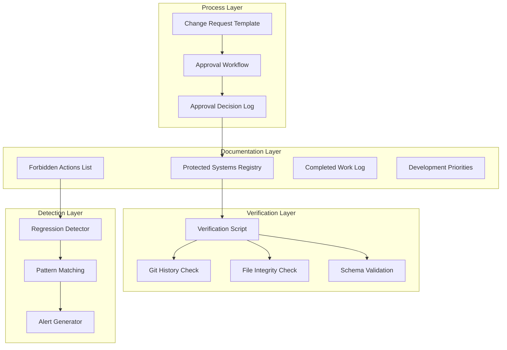
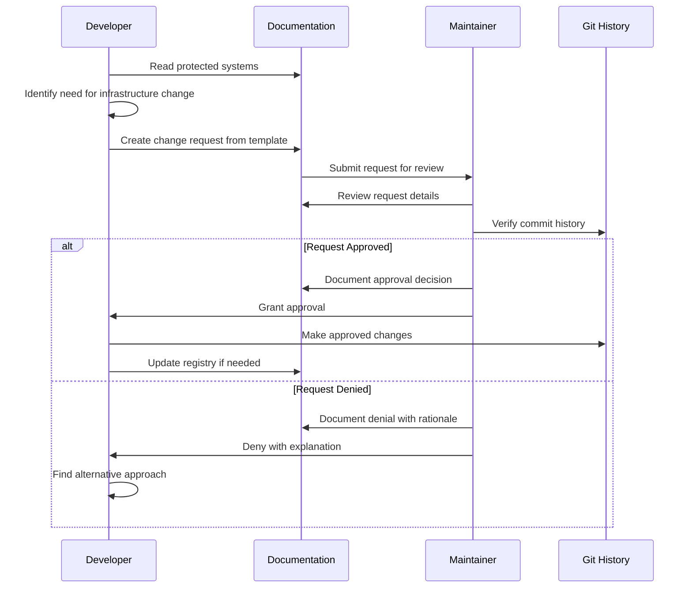
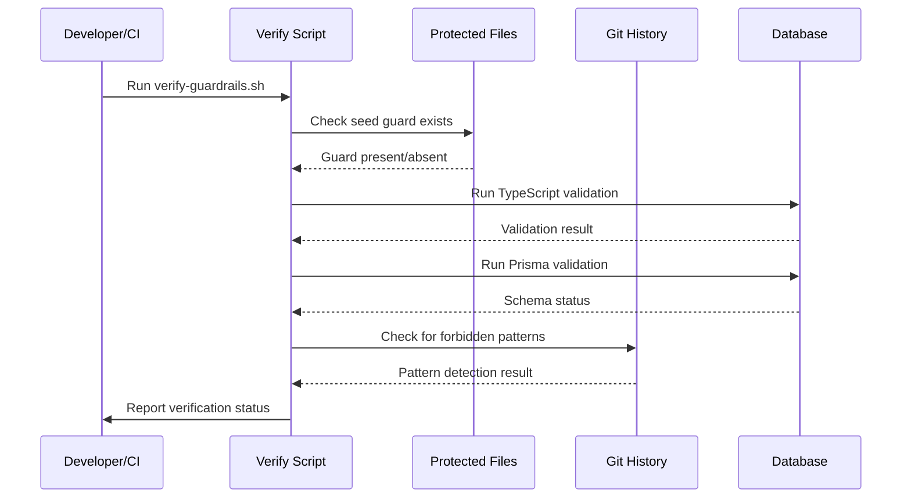

# Design Document: Project Guardrails System

## Overview

The Project Guardrails System is a documentation-driven infrastructure protection mechanism that prevents accidental regression of verified stabilization work. This design establishes a lightweight, zero-runtime-overhead system that protects the Uruziga Learning Platform's infrastructure through documentation, verification workflows, and approval gates.

### Design Principles

- **Documentation-Driven**: All guardrails exist as markdown files and structured data
- **Zero Runtime Impact**: No application code changes or performance overhead
- **Git-Based Verification**: Leverage git history for verification and audit trails
- **Developer-Friendly**: Clear, accessible documentation that developers actually read
- **Non-Intrusive**: Works alongside existing development workflows
- **Audit Trail**: Every infrastructure change is documented with approval records

### Success Criteria

- Protected systems are clearly documented and discoverable
- Developers understand what is forbidden and why
- Infrastructure changes require explicit approval before proceeding
- Verification commands confirm guardrails integrity in <5 seconds
- Zero false positives in regression detection
- Documentation updates require <2 minutes per change

### Scope

**In Scope:**
- Protected systems registry documentation
- Approval workflow processes and templates
- Verification commands and scripts
- Regression detection mechanisms
- Documentation update procedures

**Out of Scope:**
- Runtime infrastructure changes
- Application code modifications
- Prisma schema changes
- Database migrations
- CI/CD pipeline changes (Phase 1)
- Automated enforcement in git hooks (Phase 1)

## Architecture

### High-Level System Architecture



### Directory Structure

The guardrails system uses the following directory structure within `.kiro/specs/project-guardrails/`:

```
.kiro/specs/project-guardrails/
├── .config.kiro                    # Spec configuration
├── requirements.md                 # Requirements document
├── design.md                       # This design document
├── tasks.md                        # Implementation tasks (future)
├── registry/                       # Protected systems registry
│   ├── protected-systems.json     # Machine-readable registry
│   ├── protected-systems.md       # Human-readable documentation
│   └── verification-records.json  # Completed stabilization work
├── workflows/                      # Process workflows
│   ├── approval-process.md        # Approval workflow documentation
│   ├── change-request-template.md # Template for change requests
│   └── approval-log.json          # Record of all approvals
├── scripts/                        # Verification scripts
│   ├── verify-guardrails.sh       # Main verification script
│   ├── detect-regressions.sh      # Regression detection
│   └── check-protected-files.sh   # File integrity checker
└── documentation/                  # Supporting documentation
    ├── forbidden-actions.md       # List of forbidden actions
    ├── development-priorities.md  # Current development focus
    └── update-procedure.md        # How to update guardrails
```

### Data Flow Diagrams

#### Approval Workflow



#### Verification Workflow



## Components and Interfaces

### 1. Protected Systems Registry

The registry is the authoritative source of truth for all protected infrastructure components.

#### Registry Data Structure (protected-systems.json)

```json
{
  "version": "1.0.0",
  "lastUpdated": "2024-01-15T10:00:00Z",
  "protectedSystems": [
    {
      "id": "prisma-schema",
      "name": "Prisma Database Schema",
      "category": "database",
      "files": [
        "prisma/schema.prisma"
      ],
      "protectionLevel": "high",
      "stabilizationCommit": "2ba91e4",
      "verificationCommand": "npx prisma validate",
      "rationale": "Schema has been stabilized for Supabase-only storage. No breaking changes allowed without approval.",
      "contactPerson": "project-maintainer"
    },
    {
      "id": "migration-history",
      "name": "Prisma Migration History",
      "category": "database",
      "files": [
        "prisma/migrations/**"
      ],
      "protectionLevel": "critical",
      "stabilizationCommit": "2ba91e4",
      "verificationCommand": "npx prisma migrate status",
      "rationale": "Migration history must remain intact. Recreating migrations breaks production databases.",
      "contactPerson": "project-maintainer"
    },
    {
      "id": "seed-guard",
      "name": "Remote-Safe Seed Guard",
      "category": "database",
      "files": [
        "prisma/seed.ts"
      ],
      "protectionLevel": "critical",
      "stabilizationCommit": "69ad93a",
      "verificationCommand": "grep -q 'cleanAllowed' prisma/seed.ts",
      "rationale": "Seed guard prevents destructive operations on remote databases. Removal would risk production data.",
      "contactPerson": "project-maintainer"
    },
    {
      "id": "supabase-storage",
      "name": "Supabase Storage Architecture",
      "category": "storage",
      "files": [
        "lib/supabase.ts",
        "lib/storage-utils.ts"
      ],
      "protectionLevel": "high",
      "stabilizationCommit": "2ba91e4",
      "verificationCommand": "grep -L 'aws\\|vercel.*blob' lib/storage-utils.ts",
      "rationale": "Storage has been consolidated to Supabase only. AWS S3 and Vercel Blob removed.",
      "contactPerson": "project-maintainer"
    },
    {
      "id": "database-validation",
      "name": "Database Validation Scripts",
      "category": "validation",
      "files": [
        "scripts/validate-database.ts"
      ],
      "protectionLevel": "medium",
      "stabilizationCommit": "2ba91e4",
      "verificationCommand": "npm run db:validate",
      "rationale": "Validation scripts ensure database integrity. Changes must be carefully reviewed.",
      "contactPerson": "project-maintainer"
    },
    {
      "id": "typescript-config",
      "name": "TypeScript Configuration and Fixes",
      "category": "type-safety",
      "files": [
        "tsconfig.json",
        "lib/types/**"
      ],
      "protectionLevel": "medium",
      "stabilizationCommit": "2ba91e4",
      "verificationCommand": "npx tsc --noEmit",
      "rationale": "TypeScript stabilization achieved strict type safety. Regressions must be prevented.",
      "contactPerson": "project-maintainer"
    }
  ],
  "forbiddenPatterns": [
    {
      "pattern": "aws-sdk|@aws-sdk",
      "description": "AWS SDK dependencies (S3 storage removed)",
      "severity": "high"
    },
    {
      "pattern": "@vercel/blob",
      "description": "Vercel Blob storage (removed in favor of Supabase)",
      "severity": "high"
    },
    {
      "pattern": "prisma migrate reset.*--force",
      "description": "Forced migration reset (dangerous in production)",
      "severity": "critical"
    },
    {
      "pattern": "deleteMany|deleteAll.*whereRaw",
      "description": "Bulk delete operations without seed guard",
      "severity": "critical"
    }
  ]
}
```

#### Human-Readable Registry (protected-systems.md)

This markdown file presents the same information in a developer-friendly format with additional context and examples.

### 2. Verification Records

#### Structure (verification-records.json)

```json
{
  "version": "1.0.0",
  "verificationHistory": [
    {
      "timestamp": "2024-01-15T10:00:00Z",
      "commit": "2ba91e4",
      "description": "Phase 1 database, storage, and type safety stabilization",
      "verifications": [
        {
          "system": "prisma-schema",
          "test": "npx prisma validate",
          "status": "passed",
          "timestamp": "2024-01-15T09:45:00Z"
        },
        {
          "system": "migration-history",
          "test": "npx prisma migrate status",
          "status": "passed",
          "details": "All migrations applied, no pending changes",
          "timestamp": "2024-01-15T09:46:00Z"
        },
        {
          "system": "typescript-config",
          "test": "npx tsc --noEmit",
          "status": "passed",
          "timestamp": "2024-01-15T09:47:00Z"
        },
        {
          "system": "database-validation",
          "test": "npm run db:validate",
          "status": "passed",
          "timestamp": "2024-01-15T09:48:00Z"
        },
        {
          "system": "supabase-storage",
          "test": "Storage architecture review",
          "status": "passed",
          "details": "Supabase-only storage confirmed, AWS S3 and Vercel Blob removed",
          "timestamp": "2024-01-15T09:50:00Z"
        }
      ]
    },
    {
      "timestamp": "2024-01-15T11:00:00Z",
      "commit": "69ad93a",
      "description": "Seed guard implementation for remote database safety",
      "verifications": [
        {
          "system": "seed-guard",
          "test": "Seed guard presence check",
          "status": "passed",
          "details": "cleanAllowed flag and remote detection logic verified",
          "timestamp": "2024-01-15T10:55:00Z"
        },
        {
          "system": "seed-guard",
          "test": "Preflight mode test with fake Supabase",
          "status": "passed",
          "details": "Seed correctly blocks destructive operations on remote database",
          "timestamp": "2024-01-15T10:58:00Z"
        }
      ]
    }
  ]
}
```

### 3. Approval Workflow

#### Change Request Template (change-request-template.md)

```markdown
# Infrastructure Change Request

## Request Information

- **Requester**: [Your Name]
- **Date**: [YYYY-MM-DD]
- **Request ID**: [Auto-generated or manual ID]

## Change Details

### What needs to change?

[Describe the infrastructure change you want to make]

### Why is this change necessary?

[Explain the business or technical need for this change]

### Which protected systems are affected?

- [ ] Prisma Schema
- [ ] Migration History
- [ ] Seed Guard
- [ ] Supabase Storage Architecture
- [ ] Database Validation Scripts
- [ ] TypeScript Configuration
- [ ] Other: ______________

### Files to be modified

```
[List all files that will be changed]
```

### Proposed Changes

```
[Show diff, describe changes, or link to branch]
```

### Risk Assessment

**Risk Level**: [Low / Medium / High / Critical]

**Potential Impact**:
- [ ] Could break production
- [ ] Could cause data loss
- [ ] Could reintroduce fixed bugs
- [ ] Backward incompatible changes
- [ ] None of the above

**Mitigation Plan**:
[Describe how you will minimize risk]

### Testing Plan

[Describe how you will test these changes]

### Rollback Plan

[Describe how to undo these changes if needed]

## Approval Section

**Reviewer**: ______________
**Review Date**: ______________
**Decision**: [ ] Approved / [ ] Denied / [ ] Needs Revision

**Reviewer Notes**:
```

#### Approval Decision Log (approval-log.json)

```json
{
  "version": "1.0.0",
  "approvals": [
    {
      "requestId": "CR-2024-001",
      "requester": "developer-name",
      "requestDate": "2024-01-20T10:00:00Z",
      "affectedSystems": ["prisma-schema"],
      "description": "Add new field to User model for profile completion tracking",
      "decision": "approved",
      "approver": "project-maintainer",
      "approvalDate": "2024-01-20T14:30:00Z",
      "conditions": [
        "Must include migration",
        "Must update validation scripts",
        "Must test on staging first"
      ],
      "notes": "Non-breaking additive change, low risk"
    }
  ]
}
```

### 4. Verification Scripts

#### Main Verification Script (verify-guardrails.sh)

```bash
#!/bin/bash
# Verify project guardrails integrity

set -e

SCRIPT_DIR="$(cd "$(dirname "${BASH_SOURCE[0]}")" && pwd)"
PROJECT_ROOT="$(cd "$SCRIPT_DIR/../../.." && pwd)"

echo "🛡️  Project Guardrails Verification"
echo "===================================="
echo ""

# Colors for output
RED='\033[0;31m'
GREEN='\033[0;32m'
YELLOW='\033[1;33m'
NC='\033[0m' # No Color

FAILED=0

# Function to check a protected system
check_system() {
  local name=$1
  local command=$2
  
  echo -n "Checking $name... "
  
  if eval "$command" > /dev/null 2>&1; then
    echo -e "${GREEN}✓ PASS${NC}"
    return 0
  else
    echo -e "${RED}✗ FAIL${NC}"
    FAILED=$((FAILED + 1))
    return 1
  fi
}

# 1. Check seed guard is present
echo "1. Seed Guard Protection"
check_system "Seed guard presence" \
  "grep -q 'cleanAllowed' '$PROJECT_ROOT/prisma/seed.ts'"

check_system "Remote database detection" \
  "grep -q 'isSupabaseDatabase' '$PROJECT_ROOT/prisma/seed.ts'"

echo ""

# 2. Check TypeScript validation
echo "2. TypeScript Type Safety"
check_system "TypeScript compilation" \
  "cd '$PROJECT_ROOT' && npx tsc --noEmit"

echo ""

# 3. Check Prisma validation
echo "3. Database Schema Integrity"
check_system "Prisma schema validation" \
  "cd '$PROJECT_ROOT' && npx prisma validate"

check_system "Migration status" \
  "cd '$PROJECT_ROOT' && npx prisma migrate status"

echo ""

# 4. Check for forbidden patterns
echo "4. Forbidden Pattern Detection"
check_system "No AWS SDK dependencies" \
  "! grep -r 'aws-sdk\\|@aws-sdk' '$PROJECT_ROOT/package.json'"

check_system "No Vercel Blob dependencies" \
  "! grep -r '@vercel/blob' '$PROJECT_ROOT/package.json'"

echo ""

# Summary
echo "===================================="
if [ $FAILED -eq 0 ]; then
  echo -e "${GREEN}✓ All guardrails verified successfully${NC}"
  exit 0
else
  echo -e "${RED}✗ $FAILED check(s) failed${NC}"
  echo ""
  echo "Some guardrails are not in place. Please review the failures above."
  exit 1
fi
```

#### Regression Detection Script (detect-regressions.sh)

```bash
#!/bin/bash
# Detect potential regressions in protected systems

set -e

SCRIPT_DIR="$(cd "$(dirname "${BASH_SOURCE[0]}")" && pwd)"
PROJECT_ROOT="$(cd "$SCRIPT_DIR/../../.." && pwd)"
REGISTRY_FILE="$SCRIPT_DIR/../registry/protected-systems.json"

echo "🔍 Regression Detection"
echo "======================="
echo ""

# Check for migration recreation attempts
echo "Checking for migration recreation..."
MIGRATION_COUNT=$(find "$PROJECT_ROOT/prisma/migrations" -type d -mindepth 1 -maxdepth 1 | wc -l)
echo "Current migration count: $MIGRATION_COUNT"

# Check for AWS/Vercel storage reintroduction
echo ""
echo "Checking for removed storage dependencies..."
if grep -r "aws-sdk\|@aws-sdk\|@vercel/blob" "$PROJECT_ROOT/package.json" > /dev/null 2>&1; then
  echo "⚠️  WARNING: Removed storage dependencies detected"
  grep -n "aws-sdk\|@aws-sdk\|@vercel/blob" "$PROJECT_ROOT/package.json"
else
  echo "✓ No removed dependencies found"
fi

# Check for seed guard removal
echo ""
echo "Checking seed guard integrity..."
if ! grep -q "cleanAllowed" "$PROJECT_ROOT/prisma/seed.ts"; then
  echo "⚠️  WARNING: Seed guard may have been removed or modified"
else
  echo "✓ Seed guard present"
fi

echo ""
echo "Regression detection complete"
```

### 5. Development Priorities Documentation

#### Structure (development-priorities.md)

```markdown
# Current Development Priorities

**Last Updated**: 2024-01-15

## Active Development Areas

The following areas are the current development focus. These features can be implemented **without infrastructure changes**:

### 1. Adaptive Learning Journey ✨ PRIMARY FOCUS
- **Status**: In Progress
- **Spec**: `.kiro/specs/adaptive-didactic-learning-system/`
- **Infrastructure Needs**: None (uses existing schema extensions)
- **Description**: Eight-stage scaffolding system with mastery tracking

### 2. OCR Integration
- **Status**: Planned
- **Infrastructure Needs**: None (uses existing UserAttempt model)
- **Description**: Enhanced handwriting evaluation with detailed feedback

### 3. Mastery Tracking
- **Status**: In Progress
- **Infrastructure Needs**: None (uses existing UserCharacterProgress model)
- **Description**: Competency-based progress metrics

### 4. Learning Dashboard
- **Status**: Planned
- **Infrastructure Needs**: None (reads existing progress data)
- **Description**: Visual progress tracking and insights

### 5. Lesson Content
- **Status**: Ongoing
- **Infrastructure Needs**: None (uses existing Lesson/Character models)
- **Description**: Cultural context and educational content

## Infrastructure Change Freeze

The following systems are **frozen** and require approval for changes:

- ❌ Prisma schema modifications
- ❌ Database migrations
- ❌ Storage architecture changes
- ❌ Seed logic modifications
- ❌ TypeScript configuration changes

## When You Need Infrastructure Changes

If you identify a genuine need for infrastructure changes:

1. Read `.kiro/specs/project-guardrails/workflows/approval-process.md`
2. Fill out `.kiro/specs/project-guardrails/workflows/change-request-template.md`
3. Submit for maintainer review
4. Wait for approval before proceeding

## Questions?

Contact the project maintainer for guidance on:
- Whether your feature needs infrastructure changes
- Alternative approaches that avoid infrastructure changes
- Approval process questions
```

### 6. Forbidden Actions Documentation

#### Structure (forbidden-actions.md)

```markdown
# Forbidden Actions

**Last Updated**: 2024-01-15

This document lists actions that are **absolutely forbidden** without explicit maintainer approval.

## Critical Severity (🔴)

These actions could cause data loss or break production:

### 1. Recreating Migrations
```bash
# ❌ FORBIDDEN
rm -rf prisma/migrations
npx prisma migrate dev --name recreate-all
```
**Why**: Breaks migration history, causes production database sync issues
**Alternative**: Create new migrations only

### 2. Forced Migration Reset
```bash
# ❌ FORBIDDEN
npx prisma migrate reset --force
```
**Why**: Destroys all data, breaks production
**Alternative**: Use local database resets only, never on remote

### 3. Removing Seed Guard
```typescript
// ❌ FORBIDDEN
// Removing or bypassing cleanAllowed check in seed.ts
```
**Why**: Allows destructive operations on production database
**Alternative**: Never remove, only add safety checks

### 4. Automatic Production Deployment
```bash
# ❌ FORBIDDEN
git push production main --force
```
**Why**: Could deploy untested changes to live system
**Alternative**: Use staging environment, manual deployment with review

## High Severity (🟠)

These actions could reintroduce fixed bugs:

### 5. Reintroducing AWS S3 Storage
```bash
# ❌ FORBIDDEN
npm install aws-sdk
npm install @aws-sdk/client-s3
```
**Why**: Storage consolidated to Supabase, AWS removed
**Alternative**: Use Supabase storage APIs

### 6. Reintroducing Vercel Blob Storage
```bash
# ❌ FORBIDDEN
npm install @vercel/blob
```
**Why**: Storage consolidated to Supabase, Vercel Blob removed
**Alternative**: Use Supabase storage APIs

### 7. Modifying TypeScript Stabilization Fixes
```typescript
// ❌ FORBIDDEN
// Removing type definitions that fixed compilation errors
```
**Why**: Reintroduces type safety issues
**Alternative**: Extend types properly, don't remove fixes

## Medium Severity (🟡)

These actions require careful review:

### 8. Schema Breaking Changes
```prisma
// ⚠️ REQUIRES APPROVAL
// Renaming fields, changing types, removing fields
model User {
  email String // Don't rename to userEmail without approval
}
```
**Why**: Could break existing queries and frontend code
**Alternative**: Add new fields, deprecate old ones gradually

### 9. Changing Database Validation Scripts
```typescript
// ⚠️ REQUIRES APPROVAL
// Modifying scripts/validate-database.ts
```
**Why**: Validation scripts ensure data integrity
**Alternative**: Add new validations, don't remove existing ones

## How to Request Exceptions

If you have a legitimate need to perform a forbidden action:

1. Document why it's necessary
2. Show that alternatives won't work
3. Provide a detailed risk mitigation plan
4. Submit an infrastructure change request
5. Wait for maintainer approval

## Violation Consequences

- **Automated Detection**: Verification scripts will catch violations
- **Review Requirement**: Pull requests with violations require additional review
- **Rollback**: Unapproved changes will be rolled back
- **Documentation**: Violations are documented for learning
```

## Data Models

Since this is a documentation-driven system, the "data models" are file formats and structures rather than database schemas.

### Configuration Model (.config.kiro)

```json
{
  "specId": "781d0aa2-120a-45cb-8b63-aea0c6e7fd2b",
  "workflowType": "requirements-first",
  "specType": "feature"
}
```

No changes to this file are needed.

### Registry Schema

See "Protected Systems Registry" section above for the JSON schema of `protected-systems.json`.

### Approval Log Schema

See "Approval Workflow" section above for the JSON schema of `approval-log.json`.

### Verification Records Schema

See "Verification Records" section above for the JSON schema of `verification-records.json`.

## Testing Strategy

Since this is a documentation and process system (not application code), testing focuses on:

### 1. Documentation Completeness Testing

**Objective**: Ensure all documentation is complete and accurate

**Tests**:
- [ ] All protected systems are documented in registry
- [ ] All forbidden actions are listed with rationales
- [ ] All verification commands are tested and work
- [ ] All file paths in registry are valid
- [ ] All commit references are valid in git history

### 2. Verification Script Testing

**Objective**: Ensure verification scripts correctly detect violations

**Tests**:
- [ ] `verify-guardrails.sh` passes on clean repository
- [ ] `verify-guardrails.sh` fails when seed guard is removed
- [ ] `verify-guardrails.sh` fails when TypeScript has errors
- [ ] `verify-guardrails.sh` fails when Prisma schema is invalid
- [ ] `detect-regressions.sh` detects AWS SDK in package.json
- [ ] `detect-regressions.sh` detects Vercel Blob in package.json
- [ ] `detect-regressions.sh` detects missing seed guard

### 3. Approval Workflow Testing

**Objective**: Ensure approval process is clear and functional

**Tests**:
- [ ] Change request template has all required fields
- [ ] Approval process documentation is clear and actionable
- [ ] Approval log format is consistent
- [ ] Approval decisions are properly documented

### 4. Regression Detection Testing

**Objective**: Ensure regression detection catches reintroduced issues

**Test Scenarios**:
- [ ] Detect recreation of migrations
- [ ] Detect reintroduction of AWS S3 dependencies
- [ ] Detect reintroduction of Vercel Blob dependencies
- [ ] Detect removal of seed guard
- [ ] Detect TypeScript configuration changes that break compilation

### 5. Integration Testing

**Objective**: Ensure guardrails work in real development workflow

**Tests**:
- [ ] Developer can read and understand protected systems
- [ ] Developer can find approval process documentation
- [ ] Developer can run verification scripts successfully
- [ ] Verification scripts complete in <5 seconds
- [ ] Change request process takes <10 minutes to complete
- [ ] Documentation updates take <2 minutes per change

### 6. User Acceptance Testing

**Criteria**:
- [ ] Developers understand what is protected and why
- [ ] Developers know how to request infrastructure changes
- [ ] Maintainers can review requests efficiently
- [ ] Verification provides clear pass/fail results
- [ ] Documentation is discoverable and readable

## Error Handling

### Verification Script Errors

**Error**: TypeScript compilation fails
**Handling**: Report error with line numbers, exit with status 1

**Error**: Prisma validation fails
**Handling**: Report schema errors, exit with status 1

**Error**: Seed guard missing
**Handling**: Report missing guard, exit with status 1

**Error**: Forbidden pattern detected
**Handling**: Report pattern and location, exit with status 1

### Approval Workflow Errors

**Error**: Change request missing required fields
**Handling**: Return template with missing fields highlighted

**Error**: Change request affects undocumented system
**Handling**: Update registry first, then resubmit request

**Error**: Approval decision not documented
**Handling**: Require approval log entry before proceeding

### Regression Detection Errors

**Error**: Migration count decreased
**Handling**: Alert that migrations may have been deleted

**Error**: Forbidden dependency detected
**Handling**: Alert with dependency name and removal instructions

**Error**: Protected file modified without approval
**Handling**: Alert with file name and request approval process

## Implementation Phases

### Phase 1: Foundation (Week 1)

**Deliverables**:
- [ ] Directory structure created
- [ ] `protected-systems.json` populated with initial systems
- [ ] `protected-systems.md` written for developer reference
- [ ] `verification-records.json` populated with commit 2ba91e4 and 69ad93a
- [ ] `forbidden-actions.md` written and complete
- [ ] `development-priorities.md` written

### Phase 2: Workflows (Week 1)

**Deliverables**:
- [ ] `approval-process.md` written
- [ ] `change-request-template.md` created
- [ ] `approval-log.json` initialized
- [ ] `update-procedure.md` written

### Phase 3: Verification (Week 2)

**Deliverables**:
- [ ] `verify-guardrails.sh` implemented and tested
- [ ] `detect-regressions.sh` implemented and tested
- [ ] `check-protected-files.sh` implemented and tested
- [ ] All scripts executable and documented
- [ ] Scripts added to `package.json` for easy access

### Phase 4: Documentation (Week 2)

**Deliverables**:
- [ ] README.md for guardrails spec
- [ ] Integration with main project documentation
- [ ] Developer onboarding guide updated
- [ ] Examples of approved and denied requests

### Phase 5: Validation (Week 3)

**Deliverables**:
- [ ] All verification scripts tested
- [ ] Documentation reviewed for completeness
- [ ] Developer feedback collected
- [ ] Adjustments based on feedback

## Maintenance and Evolution

### Regular Updates

**Weekly**:
- Review new commits for protected system changes
- Update verification records

**Monthly**:
- Review development priorities
- Update forbidden actions if new patterns emerge
- Review approval log for trends

**Quarterly**:
- Comprehensive documentation audit
- Verify all git references are still valid
- Update verification scripts for new protected systems

### Adding New Protected Systems

1. Identify system requiring protection
2. Add entry to `protected-systems.json`
3. Update `protected-systems.md`
4. Add verification command to `verify-guardrails.sh`
5. Document rationale in registry
6. Update `update-procedure.md` if needed

### Removing Protected Systems

**Rare** - only when system is deprecated or replaced:

1. Document reason for removal
2. Verify system is truly no longer needed
3. Get maintainer approval
4. Update registry and remove entry
5. Update verification scripts
6. Document in changelog

### Version Control

Guardrails documentation follows semantic versioning:
- **Major**: Breaking changes to approval process or registry structure
- **Minor**: New protected systems added
- **Patch**: Documentation improvements, clarifications

Current version: 1.0.0

## Security Considerations

### Access Control

- **Registry**: Read-only for developers, write access for maintainers
- **Approval Log**: Read-only for developers, write access for maintainers only
- **Verification Scripts**: Executable by all developers
- **Change Requests**: Writable by all developers, approval by maintainers only

### Audit Trail

All infrastructure changes must leave an audit trail:
- Change request document
- Approval decision in approval log
- Git commit with changes
- Update to registry if needed

### Sensitive Information

Guardrails documentation should NOT contain:
- Database credentials
- API keys
- Production URLs (use placeholders)
- User data

## Performance Considerations

### Verification Speed

Target: All verification scripts complete in <5 seconds

Optimizations:
- Run checks in parallel where possible
- Cache validation results for unchanged files
- Use fast grep/file checks before slow compilation checks

### Documentation Size

Target: All documentation readable in <15 minutes

Guidelines:
- Keep documents focused and concise
- Use examples liberally
- Provide quick reference summaries
- Link to detailed information rather than duplicating

## Future Enhancements (Phase 2+)

### Automated Enforcement
- Pre-commit git hooks to run verification
- CI/CD integration to block failing verifications
- Automatic PR comments for detected violations

### Enhanced Detection
- Pattern matching against historical regressions
- Machine learning for anomaly detection
- Dependency tree analysis

### Developer Tools
- CLI tool for common guardrails operations
- VS Code extension for inline warnings
- Dashboard for guardrails status

### Metrics and Reporting
- Track approval request volume
- Measure verification pass/fail rates
- Report on most common violations

## Glossary

- **Protected System**: Infrastructure component verified as stable and requiring approval for changes
- **Verification Record**: Documentation of completed stabilization work
- **Approval Gate**: Required checkpoint before modifying protected systems
- **Infrastructure Change**: Modification to protected systems
- **Regression**: Reintroduction of a previously fixed bug or instability
- **Seed Guard**: Safety mechanism preventing destructive remote database operations
- **Forbidden Pattern**: Code pattern that reintroduces removed dependencies or bugs

## Conclusion

The Project Guardrails System provides lightweight, documentation-driven infrastructure protection through:

1. **Clear Documentation**: All protected systems are documented with rationales
2. **Explicit Workflows**: Approval process is well-defined and accessible
3. **Automated Verification**: Scripts detect violations quickly
4. **Developer-Friendly**: Low friction, high clarity
5. **Maintainable**: Easy to update and evolve

This design ensures that stabilization work is preserved while allowing necessary infrastructure evolution through an approval process.
