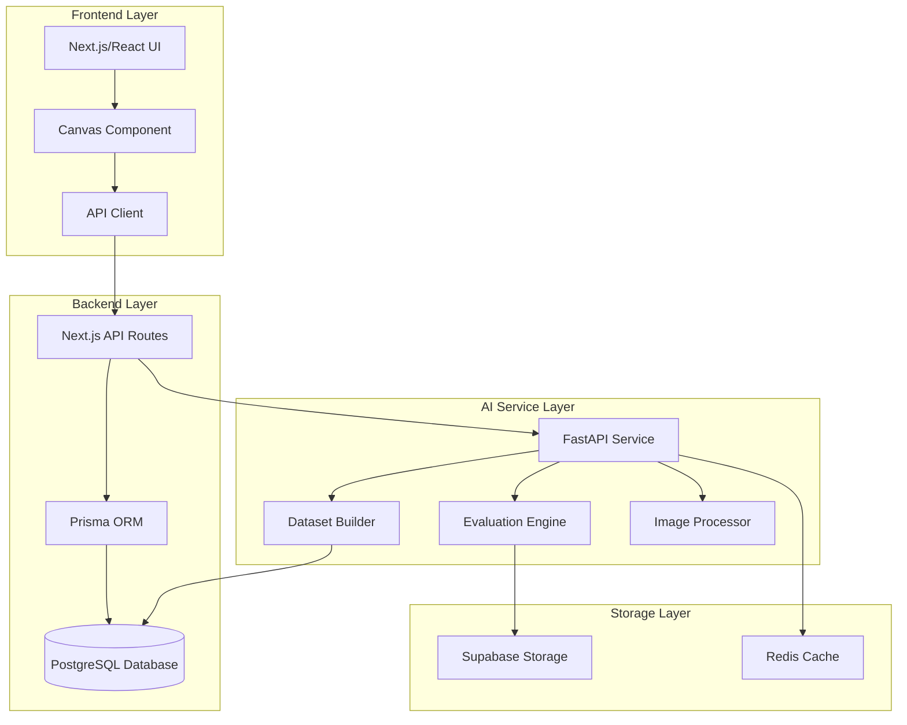

# Design Document: Uruziga AI Dataset Architecture

## Overview

The Uruziga AI Dataset Architecture transforms the existing educational platform into a production-grade dual-system that serves both as a modern learning platform and a national cultural AI dataset engine. The design maintains backward compatibility with existing components while introducing new capabilities for comprehensive data collection, advanced handwriting evaluation, and ML-ready dataset generation.

### System Architecture

The system follows a microservices architecture with three primary layers:

1. **Frontend Layer** (Next.js/React): User interface, canvas interaction, progress visualization
2. **Backend Layer** (Prisma + PostgreSQL): Primary data store, user management, progress tracking
3. **AI Service Layer** (Python FastAPI): Handwriting evaluation, dataset generation, ML pipeline

### Key Design Principles

- **Separation of Concerns**: Frontend handles UI/UX, Prisma handles data persistence, Python service handles AI/ML
- **Stateless Services**: Python AI service maintains no session state for horizontal scalability
- **Data Completeness**: Store all attempts, not just successful ones, for comprehensive datasets
- **Performance First**: 60fps canvas, <2s evaluation, optimized database queries
- **Cultural Preservation**: Every interaction contributes to the national dataset

## Architecture

### High-Level Architecture Diagram



### Data Flow

**Handwriting Submission Flow:**
1. User draws on canvas → strokes captured as coordinate arrays
2. Canvas sends strokes to Next.js API route
3. API route stores raw strokes in Prisma database
4. API route forwards strokes to Python AI service
5. Python service converts strokes to image
6. Python service evaluates against reference image
7. Python service returns score, heatmap, feedback
8. API route stores evaluation results in database
9. Frontend displays results to user

**Dataset Generation Flow:**
1. Handwriting attempt stored in database
2. Python service creates dataset entry with metadata
3. Dataset entry includes: strokes, image URL, score, timing, user context
4. Dataset entries accumulated over time
5. Export API provides ML-ready formats (JSON, CSV, TFRecord)

## Components and Interfaces

### Frontend Components

#### Canvas Component
**Purpose**: Capture handwriting input with high fidelity

**Interface:**
```typescript
interface CanvasProps {
  characterId: string;
  onStrokeComplete: (stroke: Point[]) => void;
  onSubmit: (strokes: Stroke[]) => Promise<void>;
  width: number;
  height: number;
}

interface Point {
  x: number;
  y: number;
  timestamp: number;
  pressure?: number;
}

interface Stroke {
  points: Point[];
  startTime: number;
  endTime: number;
}
```

**Key Features:**
- 60fps rendering using requestAnimationFrame
- Stroke smoothing using Catmull-Rom splines
- Support for touch, mouse, and stylus input
- Undo/redo functionality
- Real-time stroke preview

#### Evaluation Display Component
**Purpose**: Show evaluation results with visual feedback

**Interface:**
```typescript
interface EvaluationDisplayProps {
  score: number;
  heatmap: string; // Base64 encoded image
  feedback: FeedbackItem[];
  referenceImage: string;
  userImage: string;
}

interface FeedbackItem {
  type: 'stroke_order' | 'shape' | 'proportion' | 'alignment';
  severity: 'error' | 'warning' | 'info';
  message: string;
  visualAid?: string;
}
```

#### Progress Visualization Component
**Purpose**: Display learning progress and statistics

**Interface:**
```typescript
interface ProgressVisualizationProps {
  userId: string;
  characterId?: string;
  timeRange: 'week' | 'month' | 'all';
}

interface ProgressData {
  attempts: AttemptSummary[];
  averageScore: number;
  improvementRate: number;
  practiceFrequency: number;
  milestones: Milestone[];
}
```

### Backend API Routes

#### POST /api/handwriting/submit
**Purpose**: Submit handwriting for evaluation

**Request:**
```typescript
{
  characterId: string;
  strokes: Stroke[];
  sessionId: string;
  metadata: {
    deviceType: string;
    inputMethod: 'touch' | 'mouse' | 'stylus';
    canvasSize: { width: number; height: number };
  }
}
```

**Response:**
```typescript
{
  attemptId: string;
  score: number;
  feedback: FeedbackItem[];
  heatmapUrl: string;
  referenceImageUrl: string;
  processingTime: number;
}
```

#### GET /api/progress/character/:characterId
**Purpose**: Retrieve progress for a specific character

**Response:**
```typescript
{
  characterId: string;
  attempts: Array<{
    id: string;
    score: number;
    createdAt: string;
    imageUrl: string;
  }>;
  statistics: {
    totalAttempts: number;
    averageScore: number;
    bestScore: number;
    recentTrend: 'improving' | 'stable' | 'declining';
  }
}
```

#### POST /api/dataset/export
**Purpose**: Export dataset for ML training

**Request:**
```typescript
{
  format: 'json' | 'csv' | 'tfrecord';
  filters: {
    characterIds?: string[];
    dateRange?: { start: string; end: string };
    minScore?: number;
    maxScore?: number;
  };
  splitRatio?: { train: number; val: number; test: number };
}
```

**Response:**
```typescript
{
  downloadUrl: string;
  entryCount: number;
  schema: DatasetSchema;
  expiresAt: string;
}
```

### Python AI Service Endpoints

#### POST /evaluate
**Purpose**: Evaluate handwriting against reference

**Request:**
```python
{
    "character_id": str,
    "strokes": List[List[Dict[str, float]]],  # List of strokes, each stroke is list of points
    "image_data": Optional[str],  # Base64 encoded PNG (alternative to strokes)
    "options": {
        "include_heatmap": bool,
        "include_stroke_analysis": bool,
        "detail_level": "basic" | "detailed" | "expert"
    }
}
```

**Response:**
```python
{
    "score": float,  # 0-100
    "accuracy_level": "beginner" | "intermediate" | "advanced" | "expert",
    "feedback": List[Dict[str, Any]],
    "heatmap_url": Optional[str],
    "stroke_analysis": Optional[Dict[str, Any]],
    "reference_id": str,
    "processing_time_ms": int
}
```

#### POST /generate-reference
**Purpose**: Generate reference image for a character

**Request:**
```python
{
    "character": str,
    "size": int,  # Image dimension in pixels
    "format": "png" | "svg",
    "include_stroke_order": bool
}
```

**Response:**
```python
{
    "image_url": str,
    "character_id": str,
    "metadata": {
        "font_version": str,
        "rendering_params": Dict[str, Any]
    }
}
```

#### POST /store-dataset
**Purpose**: Store a dataset entry

**Request:**
```python
{
    "attempt_id": str,
    "user_id": str,
    "character_id": str,
    "strokes": List[List[Dict[str, float]]],
    "score": float,
    "metadata": Dict[str, Any]
}
```

**Response:**
```python
{
    "dataset_entry_id": str,
    "stored_at": str
}
```

## Data Models

### Prisma Schema Extensions

```prisma
model HandwritingAttempt {
  id            String   @id @default(cuid())
  userId        String
  characterId   String
  strokes       Json     // Array of stroke arrays with points
  imageUrl      String?  // URL to processed image in Supabase
  score         Float?   // 0-100 accuracy score
  feedback      Json?    // Array of feedback items
  heatmapUrl    String?  // URL to error heatmap
  metadata      Json     // Device type, input method, canvas size, etc.
  createdAt     DateTime @default(now())
  processingTime Int?    // Milliseconds taken to evaluate
  
  user          User     @relation(fields: [userId], references: [id])
  character     CharacterReference @relation(fields: [characterId], references: [id])
  
  @@index([userId, characterId])
  @@index([createdAt])
  @@index([score])
}

model CharacterReference {
  id              String   @id @default(cuid())
  umweroChar      String   @unique
  unicodeMapping  String?
  imageFontPath   String   // Path to reference image
  strokeOrder     Json?    // Canonical stroke order data
  metadata        Json     // Font version, rendering params, etc.
  createdAt       DateTime @default(now())
  updatedAt       DateTime @updatedAt
  
  attempts        HandwritingAttempt[]
  
  @@index([umweroChar])
}

model CommunityEntry {
  id          String   @id @default(cuid())
  userId      String
  text        String   @db.Text
  language    String   // 'rw' for Kinyarwanda, 'en' for English
  category    String?  // Topic categorization
  metadata    Json     // Context, tags, etc.
  createdAt   DateTime @default(now())
  
  user        User     @relation(fields: [userId], references: [id])
  
  @@index([userId])
  @@index([createdAt])
  @@index([language])
  @@fulltext([text])
}

model DatasetEntry {
  id              String   @id @default(cuid())
  attemptId       String   @unique
  userId          String   // Anonymized or hashed for privacy
  characterId     String
  strokesData     Json     // Complete stroke data
  imageUrl        String   // URL to stored image
  score           Float
  timeTaken       Int      // Milliseconds
  userMetadata    Json     // Anonymized demographics, device info
  split           String?  // 'train', 'val', or 'test'
  version         String   @default("1.0")
  createdAt       DateTime @default(now())
  
  @@index([characterId])
  @@index([split])
  @@index([createdAt])
}
```

### Dataset Entry Schema

**ML-Ready Dataset Format:**
```json
{
  "version": "1.0",
  "schema": {
    "entry_id": "string",
    "character_label": "string",
    "strokes": "array of arrays of {x, y, timestamp, pressure?}",
    "image_url": "string",
    "image_base64": "string (optional)",
    "score": "float (0-100)",
    "time_taken_ms": "integer",
    "metadata": {
      "device_type": "string",
      "input_method": "string",
      "canvas_size": {"width": "integer", "height": "integer"},
      "user_experience_level": "string",
      "timestamp": "ISO 8601 string"
    }
  },
  "entries": [
    {
      "entry_id": "abc123",
      "character_label": "ᐁ",
      "strokes": [
        [
          {"x": 100, "y": 150, "timestamp": 1234567890, "pressure": 0.8},
          {"x": 102, "y": 152, "timestamp": 1234567891, "pressure": 0.8}
        ]
      ],
      "image_url": "https://storage.example.com/images/abc123.png",
      "score": 85.5,
      "time_taken_ms": 3500,
      "metadata": {
        "device_type": "mobile",
        "input_method": "touch",
        "canvas_size": {"width": 400, "height": 400},
        "user_experience_level": "intermediate",
        "timestamp": "2024-01-15T10:30:00Z"
      }
    }
  ]
}
```

## Correctness Properties

*A property is a characteristic or behavior that should hold true across all valid executions of a system—essentially, a formal statement about what the system should do. Properties serve as the bridge between human-readable specifications and machine-verifiable correctness guarantees.*


### Canvas Performance and Data Capture

Property 1: Canvas frame rate during drawing
*For any* drawing session on the canvas, the frame rate should remain at or above 60fps throughout the interaction
**Validates: Requirements 1.2, 2.1**

Property 2: Stroke data capture completeness
*For any* stroke drawn on the canvas, all coordinate points should be captured and stored without data loss
**Validates: Requirements 2.2, 2.4**

Property 3: Input method consistency
*For any* input method (touch, mouse, stylus), the canvas should produce stroke data with consistent structure and valid coordinate values
**Validates: Requirements 2.3**

Property 4: UI responsiveness during operations
*For any* long-running operation (evaluation, data loading), the UI should remain responsive and allow user interaction with other elements
**Validates: Requirements 1.4, 9.1**

### Database Storage and Integrity

Property 5: Complete attempt storage
*For any* handwriting attempt (complete, incomplete, or practice), the database should store a record with all required fields: userId, characterId, strokes, timestamp, and metadata
**Validates: Requirements 3.1, 3.2, 3.3**

Property 6: Data reproducibility
*For any* handwriting attempt, the database should store both raw stroke data and processed image URL, ensuring full reproducibility
**Validates: Requirements 3.4, 11.2**

Property 7: Round-trip data integrity
*For any* handwriting data sent to the system, the data retrieved from storage should be identical to the original input (no data loss during transmission or storage)
**Validates: Requirements 11.1**

Property 8: Data integrity verification
*For any* stored data with checksums, the computed checksum should match the stored checksum value
**Validates: Requirements 11.3**

Property 9: Foreign key constraint enforcement
*For any* attempt to create a record with invalid foreign key reference, the database should reject the operation and return an error
**Validates: Requirements 8.4**

Property 10: Audit log creation
*For any* data modification operation, an audit log entry should be created with timestamp, user, and change details
**Validates: Requirements 11.5**

### Python AI Service Behavior

Property 11: Service statelessness
*For any* sequence of identical requests to the Python AI service, the responses should be identical regardless of request order or timing
**Validates: Requirements 4.2**

Property 12: Request processing time
*For any* evaluation request, the Python AI service should return results within 2 seconds
**Validates: Requirements 4.3**

Property 13: Reference image caching
*For any* repeated request for the same reference image, the second request should complete faster than the first (cache hit)
**Validates: Requirements 4.4**

Property 14: Comprehensive logging
*For any* request to the system, a log entry should be created containing request details, response status, processing time, and correlation ID
**Validates: Requirements 4.5, 13.4, 20.2**

Property 15: Stroke to image conversion
*For any* valid stroke data input, the Python AI service should produce a valid PNG image with consistent dimensions
**Validates: Requirements 5.1, 12.1**

Property 16: Evaluation completeness
*For any* handwriting evaluation, the response should include all required fields: score (0-100), accuracy_level, feedback array, heatmap_url, and reference_id
**Validates: Requirements 5.4**

Property 17: Evaluation data persistence
*For any* completed evaluation, the system should create database records for the attempt, processed image, and evaluation results
**Validates: Requirements 5.5**

### Dataset Generation and Export

Property 18: Dataset entry creation
*For any* evaluated handwriting attempt, a corresponding dataset entry should be created with all required metadata fields
**Validates: Requirements 6.1, 6.2**

Property 19: Dataset schema conformance
*For any* dataset entry, the data structure should conform to the defined ML training schema with all required fields present
**Validates: Requirements 6.3**

Property 20: Dataset immutability
*For any* attempt to modify an existing dataset entry, the operation should fail and the original entry should remain unchanged
**Validates: Requirements 6.4**

Property 21: Dataset export format conversion
*For any* export request with specified format (JSON, CSV, TFRecord), the returned data should be valid and parseable in that format
**Validates: Requirements 6.5, 15.1**

Property 22: Dataset export filtering
*For any* export request with filters (date range, character, demographics), all returned entries should match the filter criteria
**Validates: Requirements 15.3**

Property 23: Dataset split ratio accuracy
*For any* export request with split ratios (train/val/test), the actual split proportions should match the requested ratios within 1% tolerance
**Validates: Requirements 15.4**

### Cultural Data Collection

Property 24: Community data storage with metadata
*For any* community post or cultural entry, the database should store the content with language, timestamp, category, and user context
**Validates: Requirements 7.1, 7.2, 7.3**

Property 25: Full-text search functionality
*For any* search query on cultural data, the results should include all entries containing the search terms
**Validates: Requirements 7.4**

Property 26: Data anonymization
*For any* stored cultural data, sensitive user information (email, phone, address) should be removed or hashed while preserving text structure
**Validates: Requirements 7.5**

Property 27: Community post categorization
*For any* community post submission, the database should store it with appropriate category assignment
**Validates: Requirements 19.2**

Property 28: Rich content support
*For any* community post with formatted text or images, the stored data should preserve formatting and include image URLs
**Validates: Requirements 19.3**

### API and Frontend Behavior

Property 29: Request caching effectiveness
*For any* identical API request made twice within cache TTL, the second request should use cached data without making a server call
**Validates: Requirements 9.2**

Property 30: Retry with exponential backoff
*For any* failed API request, the system should retry up to 3 times with exponentially increasing delays between attempts
**Validates: Requirements 9.3**

Property 31: Loading state display
*For any* API request in progress, the UI should display a loading indicator until the request completes or fails
**Validates: Requirements 9.4**

Property 32: Optimistic UI updates
*For any* user action that triggers an API call, the UI should update immediately before receiving server confirmation
**Validates: Requirements 9.5**

Property 33: Image lazy loading
*For any* image in the viewport, it should be loaded; for any image outside the viewport, it should not be loaded until it enters the viewport
**Validates: Requirements 10.4, 12.5**

Property 34: CDN cache headers
*For any* static asset request (fonts, reference images, UI assets), the response should include appropriate cache-control headers
**Validates: Requirements 10.5**

### Image Processing and Storage

Property 35: Image storage path organization
*For any* stored image, the storage path should follow the defined folder structure: /{userId}/{characterId}/{attemptId}.png
**Validates: Requirements 12.2**

Property 36: Thumbnail generation
*For any* full-size image stored, a corresponding thumbnail image should be generated and stored
**Validates: Requirements 12.3**

Property 37: Image compression quality
*For any* compressed image, the SSIM (Structural Similarity Index) compared to the original should be above 0.95
**Validates: Requirements 12.4**

### Error Handling

Property 38: Error response structure
*For any* failed request, the error response should include a descriptive message, error code, and timestamp
**Validates: Requirements 13.1**

Property 39: Error message translation
*For any* error displayed to the user, the message should be in the user's selected language
**Validates: Requirements 13.2**

Property 40: Offline request queueing
*For any* API request that fails due to network error, the request should be queued and automatically retried when connection is restored
**Validates: Requirements 13.3**

Property 41: Alert triggering
*For any* error rate exceeding the configured threshold, an alert notification should be sent to monitoring systems
**Validates: Requirements 20.3**

### Authentication and Authorization

Property 42: Token expiration
*For any* session token, access should be denied after the token expiration time has passed
**Validates: Requirements 14.1**

Property 43: Role-based access control
*For any* API endpoint with role restrictions, requests from unauthorized roles should be rejected with 403 status
**Validates: Requirements 14.2**

Property 44: Data access isolation
*For any* user requesting handwriting data, only their own data should be returned unless they have admin privileges
**Validates: Requirements 14.3**

Property 45: Rate limiting enforcement
*For any* client making requests exceeding the rate limit, subsequent requests should be rejected with 429 status until the rate limit window resets
**Validates: Requirements 14.4**

### Reference Image Generation

Property 46: Reference image generation on character creation
*For any* new character added to the system, a reference image should be automatically generated and stored
**Validates: Requirements 16.1**

Property 47: Multi-size image generation
*For any* reference image generation request, images should be created at all configured sizes (small, medium, large)
**Validates: Requirements 16.2**

Property 48: Reference image metadata completeness
*For any* generated reference image, the metadata should include character code, font version, rendering parameters, and generation timestamp
**Validates: Requirements 16.3**

Property 49: Batch generation completeness
*For any* batch generation request with N characters, exactly N reference images should be generated successfully
**Validates: Requirements 16.4**

Property 50: Image validation
*For any* generated reference image, the file should be a valid PNG with non-zero dimensions and readable content
**Validates: Requirements 16.5**

### Stroke Analysis

Property 51: Stroke-level analysis inclusion
*For any* handwriting evaluation with stroke analysis enabled, the response should include direction and order analysis for each stroke
**Validates: Requirements 17.1**

Property 52: Stroke order comparison
*For any* handwriting evaluation, the system should compare the stroke sequence against the canonical order and include comparison results
**Validates: Requirements 17.2**

Property 53: Stroke error feedback specificity
*For any* evaluation with incorrect stroke order, the feedback should identify which specific strokes are incorrect by index
**Validates: Requirements 17.3**

Property 54: Stroke order overlay generation
*For any* evaluation request, a visual overlay image showing correct stroke order should be generated and included in the response
**Validates: Requirements 17.4**

Property 55: Separate stroke scoring
*For any* evaluation result, separate scores should be provided for stroke order accuracy and overall shape accuracy
**Validates: Requirements 17.5**

### Progress Tracking

Property 56: Historical attempt retention
*For any* user and character combination, all historical attempts should be stored and retrievable in chronological order
**Validates: Requirements 18.1**

Property 57: Progress statistics calculation
*For any* user's attempt history, the calculated statistics (average score, improvement rate, practice frequency) should accurately reflect the attempt data
**Validates: Requirements 18.3**

Property 58: Low-performance character identification
*For any* user's progress data, characters with average scores below the threshold should be identified and flagged for additional practice
**Validates: Requirements 18.4**

Property 59: Milestone achievement
*For any* user meeting milestone criteria (e.g., 10 attempts, 90% average score), the corresponding achievement badge should be awarded
**Validates: Requirements 18.5**

Property 60: Trending topic calculation
*For any* community discussion data, the trending topics should be calculated based on recent activity and engagement metrics
**Validates: Requirements 19.5**

Property 61: Log retention
*For any* log entry, it should be retained in the system for at least 30 days from creation
**Validates: Requirements 20.5**

## Error Handling

### Error Categories

The system implements comprehensive error handling across four categories:

1. **Client Errors (4xx)**
   - 400 Bad Request: Invalid input data, malformed requests
   - 401 Unauthorized: Missing or invalid authentication
   - 403 Forbidden: Insufficient permissions
   - 404 Not Found: Resource does not exist
   - 429 Too Many Requests: Rate limit exceeded

2. **Server Errors (5xx)**
   - 500 Internal Server Error: Unexpected server failures
   - 502 Bad Gateway: Python AI service unavailable
   - 503 Service Unavailable: System overload or maintenance
   - 504 Gateway Timeout: Request processing exceeded timeout

3. **Validation Errors**
   - Invalid stroke data format
   - Missing required fields
   - Out-of-range values
   - Unsupported character codes

4. **Processing Errors**
   - Image generation failures
   - Evaluation algorithm errors
   - Database connection failures
   - Storage service errors

### Error Response Format

All errors follow a consistent JSON structure:

```typescript
{
  error: {
    code: string;           // Machine-readable error code
    message: string;        // Human-readable description
    details?: any;          // Additional context
    timestamp: string;      // ISO 8601 timestamp
    requestId: string;      // Correlation ID for tracing
  }
}
```

### Error Handling Strategies

**Frontend Error Handling:**
- Display user-friendly translated error messages
- Implement retry logic with exponential backoff
- Queue failed requests for offline scenarios
- Provide fallback UI states
- Log errors to monitoring service

**Backend Error Handling:**
- Validate all inputs before processing
- Use try-catch blocks around external service calls
- Implement circuit breakers for Python AI service
- Return appropriate HTTP status codes
- Log errors with full context and stack traces

**Python AI Service Error Handling:**
- Validate request payloads against schemas
- Handle image processing failures gracefully
- Implement timeouts for long-running operations
- Return detailed error information for debugging
- Monitor error rates and alert on anomalies

### Recovery Mechanisms

**Automatic Recovery:**
- Retry transient failures (network errors, timeouts)
- Reconnect to database on connection loss
- Reload cached data on cache miss
- Regenerate corrupted images

**Manual Recovery:**
- Admin tools for data correction
- Reprocessing failed evaluations
- Bulk data migration utilities
- Database backup and restore procedures

## Testing Strategy

### Dual Testing Approach

The system requires both unit testing and property-based testing for comprehensive coverage:

**Unit Tests:**
- Specific examples demonstrating correct behavior
- Edge cases (empty input, boundary values, special characters)
- Error conditions (invalid input, missing data, service failures)
- Integration points between components
- Mock external dependencies for isolated testing

**Property-Based Tests:**
- Universal properties that hold for all inputs
- Comprehensive input coverage through randomization
- Minimum 100 iterations per property test
- Each test references its design document property
- Tag format: **Feature: uruziga-ai-dataset-architecture, Property {number}: {property_text}**

### Testing Framework Selection

**Frontend (TypeScript/React):**
- Jest for unit testing
- React Testing Library for component testing
- fast-check for property-based testing
- Playwright for end-to-end testing

**Backend (TypeScript/Prisma):**
- Jest for unit testing
- Supertest for API testing
- fast-check for property-based testing
- Test database for integration testing

**Python AI Service:**
- pytest for unit testing
- Hypothesis for property-based testing
- pytest-asyncio for async testing
- pytest-benchmark for performance testing

### Property Test Configuration

Each property test must:
- Run minimum 100 iterations (due to randomization)
- Reference its design document property number
- Use appropriate generators for input data
- Include shrinking for minimal failing examples
- Tag with feature name and property description

Example property test structure:

```typescript
// Feature: uruziga-ai-dataset-architecture, Property 7: Round-trip data integrity
test('handwriting data round-trip preserves all information', async () => {
  await fc.assert(
    fc.asyncProperty(
      strokeDataGenerator(),
      async (strokeData) => {
        const stored = await storeHandwriting(strokeData);
        const retrieved = await retrieveHandwriting(stored.id);
        expect(retrieved.strokes).toEqual(strokeData.strokes);
      }
    ),
    { numRuns: 100 }
  );
});
```

### Test Coverage Requirements

**Minimum Coverage Targets:**
- Unit test coverage: 80% of code lines
- Property test coverage: All correctness properties implemented
- Integration test coverage: All API endpoints
- End-to-end test coverage: Critical user flows

**Critical Paths Requiring 100% Coverage:**
- Data storage and retrieval
- Authentication and authorization
- Handwriting evaluation pipeline
- Dataset generation and export

### Performance Testing

**Load Testing:**
- Simulate 1000 concurrent users
- Measure response times under load
- Identify bottlenecks and resource constraints
- Test database connection pooling

**Stress Testing:**
- Push system beyond normal capacity
- Identify breaking points
- Test recovery mechanisms
- Validate error handling under stress

**Benchmark Testing:**
- Canvas rendering performance (60fps target)
- API response times (<2s for evaluation)
- Database query performance
- Image processing speed

### Continuous Integration

**CI Pipeline:**
1. Run linters and formatters
2. Execute unit tests
3. Execute property-based tests
4. Run integration tests
5. Check test coverage
6. Build Docker images
7. Deploy to staging environment
8. Run end-to-end tests
9. Generate test reports

**Quality Gates:**
- All tests must pass
- Coverage must meet minimum thresholds
- No critical security vulnerabilities
- Performance benchmarks must pass
- Code review approval required

### Testing Best Practices

**Property Test Design:**
- Start with simple properties
- Use appropriate generators for domain data
- Test invariants that should always hold
- Include round-trip properties for serialization
- Test error conditions with invalid inputs

**Unit Test Design:**
- Follow AAA pattern (Arrange, Act, Assert)
- One assertion per test when possible
- Use descriptive test names
- Mock external dependencies
- Test both success and failure paths

**Integration Test Design:**
- Test realistic user scenarios
- Use test database with known state
- Clean up test data after each test
- Test error handling and edge cases
- Verify side effects (database changes, logs)

### Test Data Management

**Test Data Generation:**
- Use factories for creating test objects
- Generate realistic Umwero characters
- Create varied stroke patterns
- Include edge cases in test data
- Maintain test data fixtures

**Test Database:**
- Use separate database for testing
- Reset database state between tests
- Seed with minimal required data
- Use transactions for test isolation
- Clean up after test completion

### Monitoring and Observability in Tests

**Test Instrumentation:**
- Log test execution times
- Track flaky tests
- Monitor test coverage trends
- Alert on test failures
- Generate test reports

**Test Metrics:**
- Test execution time
- Test pass/fail rates
- Coverage percentages
- Property test shrinking statistics
- Performance benchmark results
