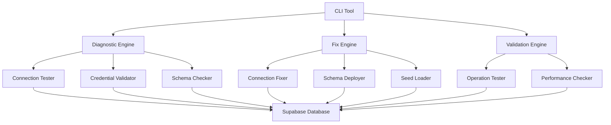

# Design Document: Database Connection Fix

## Overview

This design provides a comprehensive solution for diagnosing and fixing database connection issues in the Umwero learning platform. The solution includes diagnostic tools, automated fixes, schema validation, and recovery procedures to ensure reliable database connectivity.

## Architecture

The database connection fix system follows a modular architecture with clear separation of concerns:



## Components and Interfaces

### 1. Database Diagnostic Tool

**Purpose**: Comprehensive diagnosis of database connection issues

**Interface**:
```typescript
interface DatabaseDiagnostic {
  testConnection(config: DatabaseConfig): Promise<ConnectionResult>
  validateCredentials(config: DatabaseConfig): Promise<CredentialResult>
  checkSchema(): Promise<SchemaResult>
  generateReport(): Promise<DiagnosticReport>
}

interface ConnectionResult {
  pooledConnection: boolean
  directConnection: boolean
  latency: number
  error?: string
}

interface CredentialResult {
  valid: boolean
  permissions: string[]
  error?: string
}

interface SchemaResult {
  tablesExist: boolean
  migrationsApplied: boolean
  missingTables: string[]
  error?: string
}
```

### 2. Connection Fix Engine

**Purpose**: Automated fixing of database connection issues

**Interface**:
```typescript
interface ConnectionFixer {
  fixConnectionString(current: string): Promise<string>
  updateEnvironmentConfig(fixes: ConfigFix[]): Promise<void>
  testFixedConnection(): Promise<boolean>
  rollbackChanges(): Promise<void>
}

interface ConfigFix {
  variable: string
  oldValue: string
  newValue: string
  reason: string
}
```

### 3. Schema Deployment Manager

**Purpose**: Ensures database schema is properly deployed and up-to-date

**Interface**:
```typescript
interface SchemaDeployer {
  deploySchema(): Promise<DeploymentResult>
  validateSchema(): Promise<ValidationResult>
  generateMigrations(): Promise<Migration[]>
  applyMigrations(migrations: Migration[]): Promise<void>
}

interface DeploymentResult {
  success: boolean
  tablesCreated: number
  indexesCreated: number
  error?: string
}
```

### 4. Seed Data Manager

**Purpose**: Handles loading and validation of initial database data

**Interface**:
```typescript
interface SeedManager {
  loadSeedData(): Promise<SeedResult>
  validateSeedData(): Promise<ValidationResult>
  clearDatabase(): Promise<void>
  handleConflicts(strategy: ConflictStrategy): Promise<void>
}

enum ConflictStrategy {
  SKIP = 'skip',
  OVERWRITE = 'overwrite',
  MERGE = 'merge'
}
```

### 5. Operation Validator

**Purpose**: Validates that database operations work correctly

**Interface**:
```typescript
interface OperationValidator {
  testCrudOperations(): Promise<CrudTestResult>
  testComplexQueries(): Promise<QueryTestResult>
  testTransactions(): Promise<TransactionTestResult>
  measurePerformance(): Promise<PerformanceResult>
}

interface CrudTestResult {
  create: boolean
  read: boolean
  update: boolean
  delete: boolean
  errors: string[]
}
```

## Data Models

### Database Configuration
```typescript
interface DatabaseConfig {
  databaseUrl: string
  directUrl: string
  supabaseUrl: string
  supabaseAnonKey: string
  supabaseServiceKey: string
}
```

### Diagnostic Report
```typescript
interface DiagnosticReport {
  timestamp: Date
  connectionStatus: ConnectionStatus
  schemaStatus: SchemaStatus
  seedDataStatus: SeedDataStatus
  recommendations: Recommendation[]
  severity: 'LOW' | 'MEDIUM' | 'HIGH' | 'CRITICAL'
}

interface Recommendation {
  issue: string
  solution: string
  priority: number
  automated: boolean
}
```

### Fix Plan
```typescript
interface FixPlan {
  steps: FixStep[]
  estimatedTime: number
  riskLevel: 'LOW' | 'MEDIUM' | 'HIGH'
  backupRequired: boolean
}

interface FixStep {
  id: string
  description: string
  action: () => Promise<void>
  rollback: () => Promise<void>
  validation: () => Promise<boolean>
}
```

## Correctness Properties

*A property is a characteristic or behavior that should hold true across all valid executions of a system-essentially, a formal statement about what the system should do. Properties serve as the bridge between human-readable specifications and machine-verifiable correctness guarantees.*

### Property Reflection

After reviewing the prework analysis, I identified several areas where properties can be consolidated:

- Properties 1.1 and 1.5 both test connection type identification - these can be combined into a comprehensive connection testing property
- Properties 3.1 and 3.4 both test schema deployment completeness - these can be combined
- Properties 4.1 and 4.5 both test seeding completeness - these can be combined
- Properties 6.1 and 6.2 both test configuration validation - these can be combined into a comprehensive configuration validation property

### Converting EARS to Properties

Based on the prework analysis, here are the testable correctness properties:

Property 1: Connection diagnostic completeness
*For any* database configuration, running diagnostics should correctly identify the status of both pooled and direct connections and categorize them as working or failing
**Validates: Requirements 1.1, 1.5**

Property 2: URL validation accuracy
*For any* connection string, the validation system should correctly identify whether it follows proper PostgreSQL format and is accessible
**Validates: Requirements 1.2, 6.2**

Property 3: Credential validation correctness
*For any* set of database credentials, the authentication tester should correctly identify whether they are valid and have appropriate permissions
**Validates: Requirements 1.3**

Property 4: Diagnostic report completeness
*For any* diagnostic run, the generated report should contain connection status, authentication status, schema status, and identified issues
**Validates: Requirements 1.4**

Property 5: Connection fix generation
*For any* invalid connection string, the fix engine should generate a valid corrected connection string with proper formatting
**Validates: Requirements 2.1**

Property 6: Alternative configuration provision
*For any* detected connection pooling issue, the system should provide alternative connection configurations that resolve the issue
**Validates: Requirements 2.3**

Property 7: Fix effectiveness validation
*For any* applied database fix, both application and Prisma CLI connections should succeed after the fix is applied
**Validates: Requirements 2.4**

Property 8: Schema deployment completeness
*For any* Prisma schema, successful deployment should result in all defined tables, indexes, and constraints existing in the database
**Validates: Requirements 3.1, 3.4**

Property 9: Schema validation accuracy
*For any* database state, schema validation should correctly identify all missing tables, indexes, and constraints
**Validates: Requirements 3.2**

Property 10: Migration command generation
*For any* schema inconsistency, the system should generate appropriate migration commands that resolve the inconsistency
**Validates: Requirements 3.3**

Property 11: Foreign key relationship validation
*For any* database schema, relationship validation should correctly confirm that all foreign key relationships are properly established
**Validates: Requirements 3.5**

Property 12: Seed data loading completeness
*For any* seed data set, successful seeding should result in all expected records being present in the database with correct relationships
**Validates: Requirements 4.1, 4.5**

Property 13: Seed conflict resolution
*For any* seed data that conflicts with existing data, upsert operations should handle conflicts correctly without generating duplicate key errors
**Validates: Requirements 4.2**

Property 14: Seed data validation accuracy
*For any* seeded database, validation should correctly verify that all expected records are present with correct relationships
**Validates: Requirements 4.3**

Property 15: CRUD operation functionality
*For any* database connection, all basic CRUD operations (create, read, update, delete) should execute successfully
**Validates: Requirements 5.1**

Property 16: Complex query execution
*For any* properly connected database, complex queries including joins, aggregations, and filters should execute successfully
**Validates: Requirements 5.2**

Property 17: Transaction handling correctness
*For any* database transaction, both commit and rollback scenarios should be handled properly maintaining data consistency
**Validates: Requirements 5.3**

Property 18: Query performance compliance
*For any* simple database query, response time should be under 500ms when executed on a properly connected database
**Validates: Requirements 5.5**

Property 19: Configuration validation completeness
*For any* environment configuration, validation should correctly identify all missing or invalid database configuration variables
**Validates: Requirements 6.1**

Property 20: SSL configuration validation
*For any* database configuration, SSL validation should correctly verify that secure connections are properly configured
**Validates: Requirements 6.3**

Property 21: Connection pooling validation
*For any* connection pooling configuration, validation should correctly confirm that pool sizes and timeouts are appropriate
**Validates: Requirements 6.4**

Property 22: Configuration change validation
*For any* proposed configuration change, the system should validate that new settings work before applying them
**Validates: Requirements 6.5**

Property 23: Recovery step validation
*For any* recovery procedure, each step should be validated for successful completion before proceeding to the next step
**Validates: Requirements 7.4**

## Error Handling

The database connection fix system implements comprehensive error handling:

### Connection Errors
- **Timeout errors**: Retry with exponential backoff, suggest connection pooling adjustments
- **Authentication errors**: Provide credential validation steps and renewal procedures
- **Network errors**: Test alternative connection methods and suggest firewall/proxy checks

### Schema Errors
- **Migration failures**: Rollback to previous state, provide manual migration steps
- **Constraint violations**: Identify conflicting data, suggest resolution strategies
- **Missing tables**: Generate creation scripts, validate dependencies

### Seed Data Errors
- **Duplicate key errors**: Implement upsert strategies, provide conflict resolution options
- **Foreign key violations**: Validate data relationships, suggest dependency ordering
- **Data validation errors**: Provide detailed validation reports, suggest data corrections

### Recovery Procedures
- **Backup and restore**: Automatic backup before major changes, restore procedures for failures
- **Rollback mechanisms**: Each fix step includes rollback procedures for safe recovery
- **Alternative setups**: Provide instructions for new database instance creation when primary fails

## Testing Strategy

### Dual Testing Approach

The database connection fix system requires both unit testing and property-based testing for comprehensive coverage:

**Unit Tests**: Focus on specific examples, edge cases, and error conditions
- Test specific connection string formats (valid/invalid examples)
- Test specific credential combinations
- Test error handling for known failure scenarios
- Test integration points between diagnostic and fix components

**Property-Based Tests**: Verify universal properties across all inputs
- Generate random database configurations and test diagnostic accuracy
- Generate random connection strings and test validation correctness
- Generate random schema states and test deployment completeness
- Test fix effectiveness across various failure scenarios

### Property-Based Testing Configuration

- **Library**: Use `fast-check` for TypeScript/JavaScript property-based testing
- **Iterations**: Minimum 100 iterations per property test to ensure comprehensive coverage
- **Test Tags**: Each property test includes a comment referencing the design property
  - Format: **Feature: database-connection-fix, Property {number}: {property_text}**

### Test Coverage Requirements

- **Connection Testing**: Test all connection types (pooled, direct, SSL, non-SSL)
- **Schema Testing**: Test with various schema states (empty, partial, complete, inconsistent)
- **Seed Testing**: Test with various data states (empty, partial, conflicting)
- **Error Testing**: Test all error conditions and recovery procedures
- **Performance Testing**: Validate query response times and connection stability

### Integration Testing

- **End-to-End Scenarios**: Test complete diagnostic → fix → validation workflows
- **Database State Testing**: Test with various initial database states
- **Environment Testing**: Test with different environment configurations
- **Rollback Testing**: Verify all rollback procedures work correctly

The testing strategy ensures that the database connection fix system is reliable, handles all edge cases, and provides consistent behavior across different environments and database states.