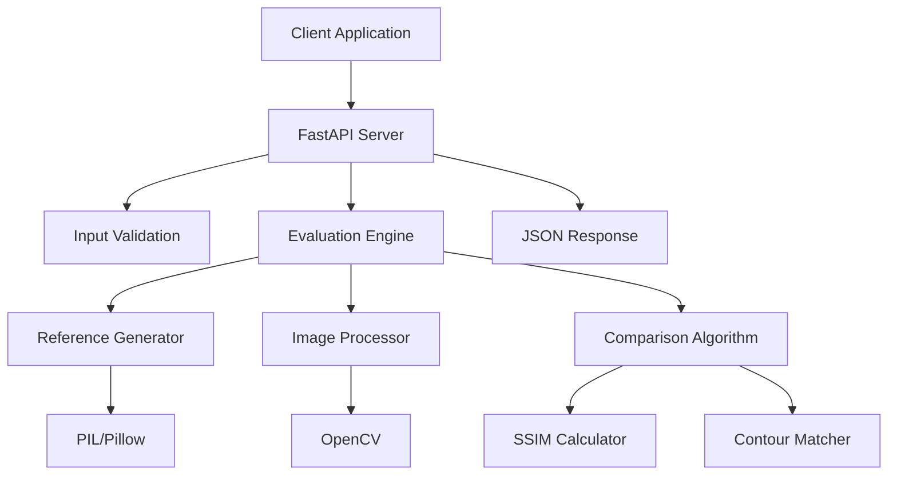

# Design Document

## Overview

The Handwriting Evaluation System (Phase 1) is a minimal FastAPI-based service that evaluates user-drawn Umwero characters against dynamically generated font references. The system employs a simple hybrid comparison algorithm combining Structural Similarity (SSIM) and contour matching to provide accurate similarity scores.

This Phase 1 implementation focuses on core evaluation functionality with a clean, simple architecture that can be quickly implemented and tested. The system accepts character drawings, generates reference images from Umwero fonts, and returns numerical similarity scores.

## Architecture

The system follows a simple layered architecture with four core components:



### Component Responsibilities

- **FastAPI Server**: HTTP request handling, routing, and JSON response formatting
- **Evaluation Engine**: Orchestrates the evaluation process
- **Reference Generator**: Dynamically renders font characters to images using PIL
- **Image Processor**: Normalizes and preprocesses images for fair comparison
- **Comparison Algorithm**: Computes similarity using SSIM and contour matching

## Components and Interfaces

### Reference Generator

**Purpose**: Dynamically generate reference character images from Umwero font files.

**Interface**:
```python
class ReferenceGenerator:
    def __init__(self, font_path: str)
    def generate_reference(self, character: str) -> PIL.Image
```

**Implementation Details**:
- Uses PIL/Pillow for font rendering
- Supports both .ttf and .otf font formats
- Renders characters at 256x256 pixels with transparent background
- Centers characters within the canvas

### Image Processor

**Purpose**: Apply consistent preprocessing to both reference and user images.

**Interface**:
```python
class ImageProcessor:
    def preprocess_image(self, image: PIL.Image) -> np.ndarray
    def resize_and_center(self, image: PIL.Image) -> PIL.Image
    def convert_to_grayscale(self, image: PIL.Image) -> PIL.Image
    def apply_binary_threshold(self, image: np.ndarray) -> np.ndarray
    def extract_bounding_box(self, image: np.ndarray) -> Tuple[int, int, int, int]
```

**Processing Pipeline**:
1. Decode base64 image data
2. Resize to 256x256 pixels
3. Convert to grayscale
4. Apply binary thresholding
5. Extract bounding box and center content

### Comparison Algorithm

**Purpose**: Compute similarity between processed images using SSIM and contour matching.

**Interface**:
```python
class ComparisonAlgorithm:
    def compare_images(self, reference: np.ndarray, user_drawing: np.ndarray) -> float
    def compute_ssim(self, img1: np.ndarray, img2: np.ndarray) -> float
    def compute_contour_similarity(self, img1: np.ndarray, img2: np.ndarray) -> float
    def combine_metrics(self, ssim: float, contour: float) -> float
```

**Hybrid Algorithm**:
- **SSIM (60% weight)**: Measures structural similarity considering luminance, contrast, and structure
- **Contour Matching (40% weight)**: Uses cv2.matchShapes for geometric shape comparison
- **Final Score**: `final_score = (0.6 * ssim) + (0.4 * (1 - contour_distance))`
- **Output Range**: Normalized to 0-100

## Data Models

### Core Data Structures

```python
@dataclass
class EvaluationRequest:
    character: str
    image: str  # base64 encoded

@dataclass
class EvaluationResponse:
    score: float  # 0-100

@dataclass
class ProcessedImage:
    grayscale: np.ndarray
    binary: np.ndarray
    bounding_box: Tuple[int, int, int, int]

@dataclass
class ComparisonResult:
    ssim_score: float
    contour_score: float
    final_score: float
```

### API Specification

**Endpoint**: `POST /api/evaluate-character`

**Request Format**:
```json
{
  "character": "A",
  "image": "data:image/png;base64,iVBORw0KGgoAAAANSUhEUgAA..."
}
```

**Response Format**:
```json
{
  "score": 85.7
}
```

**Error Response Format**:
```json
{
  "error": "Invalid character or malformed image data"
}
```

## Correctness Properties

*A property is a characteristic or behavior that should hold true across all valid executions of a system—essentially, a formal statement about what the system should do. Properties serve as the bridge between human-readable specifications and machine-verifiable correctness guarantees.*

### Property-Based Testing Properties

Property 1: Reference Image Generation
*For any* valid Umwero character, generating a reference image should produce a 256x256 pixel image with consistent rendering
**Validates: Requirements 1.1, 1.4**

Property 2: Font Format Support
*For any* valid .ttf or .otf Umwero font file, the reference generator should successfully load and render characters
**Validates: Requirements 1.2**

Property 3: Image Processing Consistency  
*For any* input image, the image processor should resize to 256x256, convert to grayscale, apply binary thresholding, and center the content consistently
**Validates: Requirements 3.1, 3.2, 3.4, 3.7**

Property 4: Hybrid Scoring Algorithm
*For any* pair of processed images, the comparison algorithm should compute SSIM (60% weight) and contour matching (40% weight), combining them into a normalized 0-100 score
**Validates: Requirements 4.1, 4.2, 4.4**

Property 5: API Response Format
*For any* valid evaluation request, the API should return a JSON response containing only a numerical score between 0-100
**Validates: Requirements 2.3**

Property 6: Performance Response Time
*For any* valid evaluation request, the system should respond within 500 milliseconds
**Validates: Requirements 2.5**

Property 7: Error Handling
*For any* invalid input (missing fonts, corrupted images, malformed data), the system should return descriptive error messages without crashing
**Validates: Requirements 8.1, 8.2, 8.6**

Property 8: Score Consistency
*For any* identical character drawing submitted multiple times, the system should return the same score (within a small tolerance for floating-point precision)
**Validates: Requirements 4.4**

## Error Handling

The system implements basic error handling for Phase 1:

### Input Validation Errors
- **Invalid Character Names**: Return HTTP 400 with descriptive message
- **Malformed Base64 Images**: Return HTTP 400 with format requirements
- **Missing Required Parameters**: Return HTTP 422 with parameter details

### Processing Errors
- **Font Loading Failures**: Return HTTP 500 with error message
- **Image Processing Failures**: Return HTTP 500 with processing error details
- **Comparison Algorithm Failures**: Return HTTP 500 with comparison error

### Error Response Format
```json
{
  "error": "Image processing failed due to invalid format"
}
```

## Testing Strategy

The system employs a dual testing approach combining unit tests for specific scenarios and property-based tests for comprehensive coverage.

### Property-Based Testing Configuration

**Framework**: Hypothesis (Python) for property-based testing
**Iterations**: Minimum 100 iterations per property test
**Test Tagging**: Each property test tagged with format: **Feature: handwriting-evaluation-system, Property {number}: {property_text}**

### Unit Testing Focus Areas

**Specific Examples**:
- Perfect character drawings → scores 90-100
- Slight variations → scores 60-85  
- Wrong shapes → scores below 50
- Edge cases: blank images, single pixels, maximum size images

**Integration Points**:
- API endpoint availability and routing
- Font file loading and character rendering
- Image format conversion and validation

**Error Conditions**:
- Invalid character names
- Malformed base64 image data
- Missing font files
- Corrupted image data

### Property Testing Implementation

Each correctness property will be implemented as a separate property-based test:

```python
@given(valid_umwero_character())
def test_reference_generation(character):
    """Feature: handwriting-evaluation-system, Property 1: Reference Image Generation"""
    # Test implementation
    pass

@given(valid_image_pair())  
def test_hybrid_scoring_algorithm(reference_image, user_image):
    """Feature: handwriting-evaluation-system, Property 4: Hybrid Scoring Algorithm"""
    # Test implementation
    pass
```

### Performance Testing

**Response Time Testing**: Verify sub-500ms response times for valid requests
**Basic Load Testing**: Ensure system handles multiple concurrent requests
**Memory Usage**: Monitor memory consumption during image processing