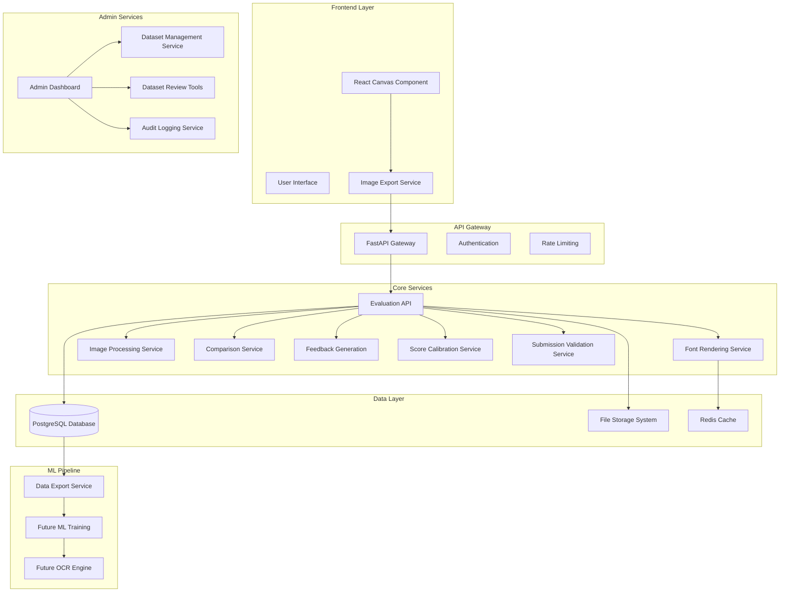

# Design Document

## Overview

The Umwero Handwriting Evaluation + OCR Dataset System is a production-grade, scalable handwriting evaluation and OCR training pipeline designed for real-world deployment. The system combines professional font rendering, advanced image processing, and sophisticated comparison algorithms to provide accurate handwriting assessment while building a comprehensive OCR training dataset.

The architecture follows a microservices approach with a React/TypeScript frontend for canvas-based drawing capture, a FastAPI backend for evaluation processing, and a PostgreSQL database optimized for OCR training data storage. The system is designed as a self-growing OCR ecosystem where every user interaction contributes to improving future character recognition capabilities.

## Architecture

The system employs a modern, scalable architecture with clear separation of concerns:



### Architectural Principles

- **Microservices Design**: Each component has a single responsibility and can be scaled independently
- **Stateless Services**: All services are stateless to support horizontal scaling
- **Data-Driven**: Every interaction generates structured training data for future ML models
- **Performance-First**: Sub-500ms response times with intelligent caching strategies
- **Production-Ready**: Comprehensive error handling, monitoring, and deployment capabilities

## Components and Interfaces

### Frontend Canvas Component

**Purpose**: Capture user handwriting and convert to standardized image format for backend evaluation.

**Technology Stack**: React 18, TypeScript, HTML5 Canvas API

**Interface**:
```typescript
interface CanvasComponent {
  // Drawing capabilities
  enableDrawing(): void
  disableDrawing(): void
  clearCanvas(): void
  undoLastStroke(): void
  eraseMode(enabled: boolean): void
  
  // Export functionality
  exportToImage(): Promise<string> // Returns base64 data URL
  exportToPNG(): Promise<Blob>
  
  // Configuration
  setStrokeWidth(width: number): void
  setStrokeColor(color: string): void
  setBrushType(type: 'pen' | 'marker' | 'pencil'): void
}

interface EvaluationRequest {
  character: string
  image: string // base64 data URL
  sessionId?: string
  userId?: string
}
```

**Implementation Details**:
- **Touch and Mouse Support**: Unified event handling for all input devices
- **Smooth Drawing**: Bezier curve interpolation for natural stroke rendering
- **High-DPI Support**: Automatic canvas scaling for retina displays
- **Export Optimization**: Canvas-to-image conversion preserving drawing quality
- **Error Handling**: Graceful fallbacks for unsupported browsers or canvas failures

### Professional Font Rendering Service

**Purpose**: Generate high-quality reference character images from Umwero font files using professional rendering techniques.

**Interface**:
```python
class FontRenderingService:
    def __init__(self, font_path: str, rendering_engine: str = 'auto')
    
    def render_character(self, character: str, size: int = 256) -> PIL.Image
    def get_character_metrics(self, character: str) -> CharacterMetrics
    def precompute_references(self, characters: List[str]) -> Dict[str, ReferenceData]
    def validate_font_quality(self) -> FontQualityReport

@dataclass
class CharacterMetrics:
    width: int
    height: int
    baseline: int
    ascent: int
    descent: int
    advance_width: int

@dataclass
class ReferenceData:
    image: PIL.Image
    processed_image: np.ndarray
    skeleton_image: np.ndarray
    features: FeatureVector
    metrics: CharacterMetrics
```

**Rendering Engine Selection**:
1. **Primary**: FreeType-py for professional font rendering
2. **Fallback**: Cairo/Pycairo for complex font features
3. **Alternative**: fontTools + Pillow for basic rendering
4. **Quality Validation**: Automatic assessment of rendering quality

**Implementation Strategy**:
- **Multi-Engine Support**: Automatic selection of best rendering engine based on font complexity
- **Quality Assurance**: Validation that rendered characters match font design exactly
- **Caching Strategy**: Precomputed references with feature extraction for performance
- **Error Recovery**: Graceful fallbacks when primary rendering engines fail

### Advanced Image Processing Pipeline

**Purpose**: Apply sophisticated preprocessing to ensure fair and accurate image comparisons.

**Interface**:
```python
class ImageProcessingPipeline:
    def __init__(self, config: ProcessingConfig)
    
    def preprocess_image(self, image: PIL.Image) -> ProcessedImage
    def normalize_drawing(self, image: PIL.Image) -> PIL.Image
    def extract_features(self, processed_image: np.ndarray) -> FeatureVector
    def generate_skeleton(self, binary_image: np.ndarray) -> np.ndarray

@dataclass
class ProcessedImage:
    original: PIL.Image
    grayscale: np.ndarray
    binary: np.ndarray
    normalized: np.ndarray
    skeleton: np.ndarray
    bounding_box: Tuple[int, int, int, int]
    center_offset: Tuple[int, int]

@dataclass
class FeatureVector:
    contour_area: float
    aspect_ratio: float
    bounding_box: Tuple[int, int, int, int]
    stroke_count: int
    loop_count: int
    endpoint_count: int
    intersection_count: int
    perimeter: float
    solidity: float
    extent: float
```

**Processing Pipeline**:
1. **Input Validation**: Verify image format and basic quality checks
2. **Standardization**: Resize to 256x256 with aspect ratio preservation
3. **Grayscale Conversion**: Optimized conversion preserving stroke information
4. **Noise Reduction**: Gaussian blur and morphological operations
5. **Binary Thresholding**: Adaptive thresholding for varying lighting conditions
6. **Centering**: Bounding box detection and content centering
7. **Skeletonization**: Zhang-Suen algorithm for structural analysis
8. **Feature Extraction**: Comprehensive geometric and topological features

### Hybrid Comparison Algorithm

**Purpose**: Implement sophisticated multi-metric comparison for accurate handwriting evaluation.

**Interface**:
```python
class HybridComparisonAlgorithm:
    def __init__(self, weights: ComparisonWeights = None)
    
    def compare_images(self, reference: ProcessedImage, user_drawing: ProcessedImage) -> ComparisonResult
    def compute_ssim(self, img1: np.ndarray, img2: np.ndarray) -> float
    def compute_contour_similarity(self, img1: np.ndarray, img2: np.ndarray) -> float
    def compute_skeleton_similarity(self, skel1: np.ndarray, skel2: np.ndarray) -> SkeletonAnalysis
    def calibrate_score(self, raw_score: float, character: str) -> float

@dataclass
class ComparisonWeights:
    ssim_weight: float = 0.4
    contour_weight: float = 0.3
    skeleton_weight: float = 0.3

@dataclass
class SkeletonAnalysis:
    structural_similarity: float
    topology_match: float
    stroke_connectivity: float
    missing_strokes: List[str]
    extra_strokes: List[str]

@dataclass
class ComparisonResult:
    ssim_score: float
    contour_score: float
    skeleton_score: float
    final_score: float
    confidence: float
    analysis: SkeletonAnalysis
```

**Algorithm Implementation**:

**SSIM Analysis (40% weight)**:
- Structural similarity using scikit-image implementation
- Multi-scale SSIM for different detail levels
- Luminance, contrast, and structure components

**Contour Matching (30% weight)**:
- OpenCV cv2.matchShapes with Hu moments
- Contour hierarchy analysis for nested shapes
- Robust handling of multiple contours

**Skeleton Analysis (30% weight)**:
- Zhang-Suen skeletonization algorithm
- Topological analysis: endpoints, junctions, loops
- Stroke connectivity and completeness assessment
- Missing/extra stroke detection

**Score Calibration**:
- Character-specific score normalization
- Statistical calibration based on training data
- Confidence intervals for score reliability

### Intelligent Feedback Generation

**Purpose**: Generate actionable, human-readable feedback for handwriting improvement.

**Interface**:
```python
class FeedbackGenerator:
    def __init__(self, feedback_config: FeedbackConfig)
    
    def generate_feedback(self, comparison_result: ComparisonResult, 
                         processed_images: Tuple[ProcessedImage, ProcessedImage]) -> FeedbackReport
    def analyze_structural_issues(self, skeleton_analysis: SkeletonAnalysis) -> List[StructuralFeedback]
    def analyze_positioning_issues(self, reference: ProcessedImage, user: ProcessedImage) -> List[PositionFeedback]
    def prioritize_feedback(self, feedback_items: List[FeedbackItem]) -> List[FeedbackItem]

@dataclass
class FeedbackReport:
    score: float
    passed: bool
    primary_feedback: List[str]
    detailed_feedback: List[FeedbackItem]
    positive_aspects: List[str]
    improvement_priority: List[str]

@dataclass
class FeedbackItem:
    category: str  # 'structure', 'positioning', 'proportions', 'strokes'
    severity: str  # 'critical', 'major', 'minor'
    message: str
    suggestion: str
    confidence: float
```

**Feedback Categories**:
- **Structural Issues**: Missing strokes, incorrect topology, open vs closed shapes
- **Positioning Problems**: Off-center, rotation, scale issues
- **Proportional Errors**: Aspect ratio, relative sizing of character parts
- **Stroke Quality**: Thickness, smoothness, connection points
- **Positive Reinforcement**: Well-executed aspects to encourage learning

### Character-Specific Score Calibration Service

**Purpose**: Apply character-specific difficulty profiles and scoring adjustments to ensure fair evaluation across different complexity levels.

**Interface**:
```python
class ScoreCalibrationService:
    def __init__(self, calibration_config: CalibrationConfig)
    
    def calibrate_score(self, raw_score: float, character: str, metrics: ComparisonResult) -> CalibratedScore
    def get_character_profile(self, character: str) -> CharacterProfile
    def update_character_profile(self, character: str, profile: CharacterProfile) -> bool
    def analyze_performance_data(self, character: str, timeframe: str) -> PerformanceAnalysis

@dataclass
class CharacterProfile:
    character: str
    complexity_rating: float  # 1.0 (simple) to 5.0 (complex)
    base_tolerance: float
    stroke_count: int
    has_loops: bool
    has_curves: bool
    difficulty_factors: List[str]
    score_adjustments: Dict[str, float]

@dataclass
class CalibratedScore:
    raw_score: float
    calibrated_score: float
    adjustment_factor: float
    character_profile: CharacterProfile
    calibration_reason: str
```

**Calibration Strategy**:
- **Simple Characters** (A, I, L): Stricter scoring with minimal tolerance
- **Medium Characters** (B, D, P): Standard scoring with moderate tolerance  
- **Complex Characters** (ligatures, curved forms): More lenient scoring with higher tolerance
- **Dynamic Adjustment**: Statistical analysis of user performance to refine profiles

### Submission Validation Service

**Purpose**: Detect and prevent invalid submissions, cheating attempts, and low-quality data from entering the OCR dataset.

**Interface**:
```python
class SubmissionValidationService:
    def __init__(self, validation_config: ValidationConfig)
    
    def validate_submission(self, image: PIL.Image, metadata: SubmissionMetadata) -> ValidationResult
    def detect_blank_canvas(self, image: PIL.Image) -> bool
    def detect_random_patterns(self, image: PIL.Image) -> PatternAnalysis
    def check_rate_limits(self, user_id: str, session_id: str) -> RateLimitResult
    def analyze_drawing_authenticity(self, image: PIL.Image) -> AuthenticityScore

@dataclass
class ValidationResult:
    is_valid: bool
    confidence: float
    rejection_reasons: List[str]
    flags: List[ValidationFlag]
    should_store: bool
    penalty_level: int

@dataclass
class PatternAnalysis:
    is_random_dots: bool
    is_scribble: bool
    stroke_coherence: float
    geometric_consistency: float
    handwriting_likelihood: float

@dataclass
class ValidationFlag:
    flag_type: str  # 'blank', 'random', 'spam', 'corrupted', 'suspicious'
    severity: str   # 'low', 'medium', 'high', 'critical'
    description: str
    confidence: float
```

**Validation Techniques**:
- **Blank Detection**: Pixel density analysis, connected component counting
- **Pattern Recognition**: Stroke connectivity analysis, geometric coherence
- **Authenticity Scoring**: Handwriting characteristics, natural stroke patterns
- **Rate Limiting**: Per-user, per-session, and per-IP submission limits
- **Metadata Analysis**: Drawing time analysis, submission pattern detection

### Admin Dataset Management Dashboard

**Purpose**: Provide comprehensive tools for dataset review, quality control, and ML training preparation.

**Interface**:
```python
class DatasetManagementService:
    def __init__(self, db: Database, storage: FileStorage, auth: AdminAuth)
    
    def get_dataset_overview(self, filters: DatasetFilters) -> DatasetOverview
    def review_submissions(self, filters: ReviewFilters, pagination: Pagination) -> ReviewResults
    def relabel_submission(self, submission_id: str, new_label: str, reason: str, admin_id: str) -> bool
    def bulk_delete_submissions(self, submission_ids: List[str], reason: str, admin_id: str) -> BulkResult
    def export_dataset(self, export_config: ExportConfig, admin_id: str) -> ExportResult

@dataclass
class DatasetOverview:
    total_submissions: int
    label_distribution: Dict[str, int]
    character_distribution: Dict[str, int]
    quality_metrics: QualityMetrics
    flagged_submissions: int
    recent_activity: List[ActivityLog]

@dataclass
class ReviewResults:
    submissions: List[SubmissionReview]
    total_count: int
    filters_applied: ReviewFilters
    quality_indicators: Dict[str, float]

@dataclass
class SubmissionReview:
    id: str
    character: str
    score: float
    label: str
    images: ImageSet
    metadata: SubmissionMetadata
    flags: List[ValidationFlag]
    admin_notes: List[AdminNote]
```

**Dashboard Features**:
- **Visual Review**: Side-by-side comparison of original, processed, and skeleton images
- **Filtering System**: Multi-criteria filtering by character, score, date, flags, labels
- **Bulk Operations**: Mass relabeling, deletion, and export with confirmation workflows
- **Quality Analytics**: Real-time quality metrics and trend analysis
- **Audit Trail**: Complete logging of all admin actions with timestamps and justifications

### OCR Dataset Storage System

**Purpose**: Store comprehensive training data optimized for future machine learning workflows.

**Database Schema**:
```sql
-- Core drawing attempts table
CREATE TABLE drawing_attempts (
    id UUID PRIMARY KEY DEFAULT gen_random_uuid(),
    user_id UUID REFERENCES users(id),
    character VARCHAR(10) NOT NULL,
    session_id VARCHAR(100),
    
    -- Images (stored as file paths)
    raw_image_path VARCHAR(500) NOT NULL,
    processed_image_path VARCHAR(500) NOT NULL,
    skeleton_image_path VARCHAR(500) NOT NULL,
    
    -- Evaluation results
    score DECIMAL(5,2) NOT NULL CHECK (score >= 0 AND score <= 100),
    passed BOOLEAN NOT NULL,
    confidence DECIMAL(4,3),
    
    -- Automatic labeling
    label VARCHAR(20) NOT NULL, -- 'correct', 'incorrect'
    
    -- Timestamps
    created_at TIMESTAMP WITH TIME ZONE DEFAULT NOW(),
    processed_at TIMESTAMP WITH TIME ZONE,
    
    -- Indexing for ML queries
    INDEX idx_character_label (character, label),
    INDEX idx_score_range (score),
    INDEX idx_created_at (created_at)
);

-- Feature vectors table
CREATE TABLE feature_vectors (
    attempt_id UUID PRIMARY KEY REFERENCES drawing_attempts(id),
    
    -- Geometric features
    contour_area DECIMAL(10,4),
    aspect_ratio DECIMAL(6,4),
    bounding_box_x INTEGER,
    bounding_box_y INTEGER,
    bounding_box_width INTEGER,
    bounding_box_height INTEGER,
    
    -- Topological features
    stroke_count INTEGER,
    loop_count INTEGER,
    endpoint_count INTEGER,
    intersection_count INTEGER,
    
    -- Shape features
    perimeter DECIMAL(10,4),
    solidity DECIMAL(6,4),
    extent DECIMAL(6,4),
    
    -- Comparison metrics
    ssim_score DECIMAL(6,4),
    contour_score DECIMAL(6,4),
    skeleton_score DECIMAL(6,4)
);

-- Feedback records table
CREATE TABLE feedback_records (
    id UUID PRIMARY KEY DEFAULT gen_random_uuid(),
    attempt_id UUID REFERENCES drawing_attempts(id),
    category VARCHAR(50) NOT NULL,
    severity VARCHAR(20) NOT NULL,
    message TEXT NOT NULL,
    suggestion TEXT,
    confidence DECIMAL(4,3)
);

-- Character difficulty profiles table
CREATE TABLE character_profiles (
    character VARCHAR(10) PRIMARY KEY,
    complexity_rating DECIMAL(3,2) NOT NULL CHECK (complexity_rating >= 1.0 AND complexity_rating <= 5.0),
    base_tolerance DECIMAL(4,3) NOT NULL,
    stroke_count INTEGER,
    has_loops BOOLEAN DEFAULT FALSE,
    has_curves BOOLEAN DEFAULT FALSE,
    difficulty_factors TEXT[], -- Array of difficulty factor strings
    score_adjustments JSONB, -- JSON object with adjustment parameters
    created_at TIMESTAMP WITH TIME ZONE DEFAULT NOW(),
    updated_at TIMESTAMP WITH TIME ZONE DEFAULT NOW()
);

-- Submission validation flags table
CREATE TABLE validation_flags (
    id UUID PRIMARY KEY DEFAULT gen_random_uuid(),
    attempt_id UUID REFERENCES drawing_attempts(id),
    flag_type VARCHAR(50) NOT NULL, -- 'blank', 'random', 'spam', 'corrupted', 'suspicious'
    severity VARCHAR(20) NOT NULL, -- 'low', 'medium', 'high', 'critical'
    description TEXT NOT NULL,
    confidence DECIMAL(4,3),
    auto_detected BOOLEAN DEFAULT TRUE,
    created_at TIMESTAMP WITH TIME ZONE DEFAULT NOW(),
    
    INDEX idx_flag_type_severity (flag_type, severity),
    INDEX idx_attempt_flags (attempt_id)
);

-- Admin actions audit log table
CREATE TABLE admin_audit_log (
    id UUID PRIMARY KEY DEFAULT gen_random_uuid(),
    admin_id UUID NOT NULL, -- References admin user
    action_type VARCHAR(50) NOT NULL, -- 'relabel', 'delete', 'export', 'profile_update'
    target_type VARCHAR(50) NOT NULL, -- 'submission', 'character_profile', 'dataset'
    target_id VARCHAR(100), -- ID of affected entity
    old_value JSONB, -- Previous state
    new_value JSONB, -- New state
    reason TEXT,
    ip_address INET,
    user_agent TEXT,
    created_at TIMESTAMP WITH TIME ZONE DEFAULT NOW(),
    
    INDEX idx_admin_actions (admin_id, created_at),
    INDEX idx_action_type (action_type),
    INDEX idx_target (target_type, target_id)
);

-- Rate limiting tracking table
CREATE TABLE rate_limits (
    id UUID PRIMARY KEY DEFAULT gen_random_uuid(),
    user_id UUID,
    session_id VARCHAR(100),
    ip_address INET,
    submission_count INTEGER DEFAULT 1,
    window_start TIMESTAMP WITH TIME ZONE DEFAULT NOW(),
    blocked_until TIMESTAMP WITH TIME ZONE,
    
    INDEX idx_user_rate_limit (user_id, window_start),
    INDEX idx_session_rate_limit (session_id, window_start),
    INDEX idx_ip_rate_limit (ip_address, window_start)
);
```

**File Storage Strategy**:
- **Local Development**: File system with organized directory structure
- **Production**: AWS S3 or Cloudinary for scalable image storage
- **Path Convention**: `/{environment}/{character}/{year}/{month}/{uuid}.png`
- **Metadata Only**: Database stores file paths, not binary data

### Production API Service

**Purpose**: Provide high-performance, scalable evaluation API with comprehensive error handling.

**FastAPI Implementation**:
```python
from fastapi import FastAPI, HTTPException, Depends
from fastapi.middleware.cors import CORSMiddleware
from fastapi.middleware.gzip import GZipMiddleware

app = FastAPI(
    title="Umwero Handwriting Evaluation API",
    description="Production-grade handwriting evaluation and OCR dataset system",
    version="1.0.0"
)

# Middleware
app.add_middleware(GZipMiddleware, minimum_size=1000)
app.add_middleware(CORSMiddleware, allow_origins=["*"])

@app.post("/api/evaluate-character", response_model=EvaluationResponse)
async def evaluate_character(
    request: EvaluationRequest,
    db: Database = Depends(get_database),
    cache: Cache = Depends(get_cache)
) -> EvaluationResponse:
    """
    Evaluate user handwriting against font reference.
    
    Returns:
        EvaluationResponse with score, feedback, and pass/fail status
    """
    # Implementation with comprehensive error handling

@app.get("/api/reference/{character}", response_model=ReferenceResponse)
async def get_reference_image(character: str, cache: Cache = Depends(get_cache)):
    """Get reference image for a character."""
    # Implementation

@app.get("/health")
async def health_check():
    """Health check endpoint for load balancers."""
    return {"status": "healthy", "timestamp": datetime.utcnow()}

@app.get("/metrics")
async def get_metrics():
    """Prometheus-compatible metrics endpoint."""
    # Implementation
```

## Data Models

### Core Data Structures

```python
from pydantic import BaseModel, Field
from typing import List, Optional, Tuple
from datetime import datetime
from enum import Enum

class EvaluationRequest(BaseModel):
    character: str = Field(..., min_length=1, max_length=10)
    image: str = Field(..., regex=r'^data:image/(png|jpeg);base64,')
    session_id: Optional[str] = None
    user_id: Optional[str] = None

class EvaluationResponse(BaseModel):
    score: float = Field(..., ge=0, le=100)
    passed: bool
    feedback: List[str]
    detailed_feedback: List[FeedbackItem]
    confidence: float = Field(..., ge=0, le=1)
    processing_time_ms: int

class FeedbackItem(BaseModel):
    category: str
    severity: str
    message: str
    suggestion: str
    confidence: float

class ReferenceResponse(BaseModel):
    character: str
    image_url: str
    metrics: CharacterMetrics
    cached: bool

class TrainingDataRecord(BaseModel):
    id: str
    character: str
    score: float
    label: str
    features: FeatureVector
    created_at: datetime
    
class MLDatasetExport(BaseModel):
    total_records: int
    characters: List[str]
    label_distribution: dict
    export_format: str
    download_url: str
```

## Correctness Properties

*A property is a characteristic or behavior that should hold true across all valid executions of a system—essentially, a formal statement about what the system should do. Properties serve as the bridge between human-readable specifications and machine-verifiable correctness guarantees.*

Now I'll analyze the acceptance criteria to determine which are testable as properties, examples, or edge cases.

### Property-Based Testing Properties

After analyzing the acceptance criteria and performing property reflection to eliminate redundancy, the following consolidated properties provide comprehensive coverage:

Property 1: Font Rendering Correctness
*For any* valid Umwero character and supported font format (.ttf/.otf), the font renderer should generate a 256x256 pixel reference image with high quality, proper centering, and consistent caching behavior
**Validates: Requirements 1.1, 1.2, 1.3, 1.4, 1.5**

Property 2: Canvas Export Consistency  
*For any* canvas drawing content, the frontend canvas should export to valid PNG data URL format with preserved image quality and correct JSON request structure
**Validates: Requirements 2.4, 2.5, 2.6**

Property 3: API Response Completeness
*For any* valid evaluation request, the API should return JSON responses with score (0-100), feedback array, pass/fail status (passed = score >= 70), and proper HTTP status codes within 500ms
**Validates: Requirements 3.1, 3.2, 3.3, 3.4, 3.5**

Property 4: Image Processing Pipeline Consistency
*For any* input image, the image processor should apply identical preprocessing (resize, grayscale, threshold, center, normalize) to both reference and user images, handling edge cases gracefully
**Validates: Requirements 4.1, 4.2, 4.3, 4.4, 4.5**

Property 5: Hybrid Algorithm Scoring Accuracy
*For any* pair of processed images, the hybrid algorithm should compute SSIM (40%), contour matching (30%), and skeleton analysis (30%) using the exact formula: final_score = (0.4 * ssim_score + 0.3 * (1 - contour_distance) + 0.3 * skeleton_similarity), normalized to 0-100 range
**Validates: Requirements 5.1, 5.2, 5.3, 5.4, 5.5**

Property 6: Algorithm Determinism and Robustness
*For any* identical input pair, the hybrid algorithm should produce identical scores and handle individual metric failures by adjusting weights proportionally
**Validates: Requirements 5.6, 5.7**

Property 7: Feedback Generation Completeness
*For any* evaluated drawing, the feedback engine should generate human-readable suggestions, identify specific issues (missing strokes, proportions, positioning), distinguish shape topology, and provide positive reinforcement for quality drawings
**Validates: Requirements 6.1, 6.2, 6.3, 6.4, 6.5**

Property 8: OCR Dataset Storage Completeness
*For any* evaluation attempt, the system should store all required data (character, images, score, features, metadata) with automatic labeling (score >= 70 = "correct") and proper file path storage (not base64 blobs)
**Validates: Requirements 7.1, 7.2, 7.3, 7.4, 7.5, 7.7**

Property 9: Database Performance and Integrity
*For any* database operation, the system should maintain proper constraints, relationships, data integrity, and support efficient ML-related queries with optimized indexing
**Validates: Requirements 8.2, 8.3, 8.4, 8.5**

Property 10: System Performance and Scalability
*For any* evaluation request under normal load, the system should respond within 500ms, implement effective caching, handle concurrent requests without degradation, maintain stateless operation, and manage resources efficiently
**Validates: Requirements 9.1, 9.2, 9.3, 9.4, 9.5**

Property 11: ML Data Export Compatibility
*For any* stored training data, the system should collect sufficient metadata and features, ensure compatibility with ML frameworks (TensorFlow, PyTorch), support data export capabilities, and maintain quality standards for OCR training
**Validates: Requirements 10.2, 10.3, 10.4, 10.5**

Property 12: Production Operations Support
*For any* production deployment, the system should provide health check endpoints, implement proper logging and monitoring, externalize configuration, enforce security measures, and support database migrations
**Validates: Requirements 9.6, 11.2, 11.3, 11.4, 11.6**

Property 13: Character-Specific Score Calibration
*For any* Umwero character evaluation, the system should apply character-specific difficulty profiles and scoring tolerance adjustments to ensure fair assessment across characters with different complexity levels
**Validates: Requirements 13.1, 13.2, 13.3, 13.4, 13.5, 13.7**

Property 14: Admin Dataset Management Completeness
*For any* admin dataset operation, the system should provide comprehensive review tools, manual relabeling capabilities, bulk operations, export functionality, and maintain complete audit trails
**Validates: Requirements 14.1, 14.2, 14.3, 14.4, 14.5, 14.7, 14.8**

Property 15: Invalid Submission Detection Accuracy
*For any* submission attempt, the system should accurately detect blank canvases, random patterns, non-handwritten content, spam submissions, corrupted uploads, and suspicious metadata while maintaining low false positive rates
**Validates: Requirements 15.1, 15.2, 15.3, 15.4, 15.5, 15.6, 15.7, 15.9**

## Error Handling

The system implements comprehensive error handling across all layers:

### Input Validation Errors
- **Invalid Character Names**: HTTP 400 with supported character list
- **Malformed Base64 Images**: HTTP 400 with format requirements and examples
- **Missing Required Parameters**: HTTP 422 with detailed parameter validation errors
- **Image Size/Format Issues**: HTTP 400 with size and format constraints

### Font Rendering Errors
- **Missing Font Files**: HTTP 500 with font path and installation instructions
- **Corrupted Font Data**: HTTP 500 with font validation error details
- **Unsupported Characters**: HTTP 400 with available character list
- **Rendering Engine Failures**: Automatic fallback to alternative rendering engines

### Image Processing Errors
- **Invalid Image Data**: HTTP 400 with image validation error details
- **Processing Pipeline Failures**: HTTP 500 with specific processing step error
- **Memory/Resource Constraints**: HTTP 503 with retry-after header
- **Feature Extraction Failures**: Graceful degradation with partial features

### Comparison Algorithm Errors
- **SSIM Calculation Failures**: Continue with contour and skeleton metrics
- **Contour Detection Failures**: Adjust weights to SSIM (60%) and skeleton (40%)
- **Skeletonization Failures**: Adjust weights to SSIM (70%) and contour (30%)
- **Complete Algorithm Failure**: HTTP 500 with detailed error analysis

### Database and Storage Errors
- **Database Connection Failures**: Retry logic with exponential backoff
- **Storage Write Failures**: Queue for later retry, continue evaluation
- **Transaction Failures**: Rollback with detailed error logging
- **Constraint Violations**: HTTP 400 with constraint details

### Error Response Format
```json
{
  "error": {
    "code": "FONT_RENDERING_FAILED",
    "message": "Unable to render character 'A' from font file",
    "details": {
      "font_path": "/fonts/umwero.ttf",
      "character": "A",
      "rendering_engine": "freetype",
      "suggestion": "Verify font file integrity and character support"
    },
    "timestamp": "2024-01-15T10:30:00Z",
    "request_id": "req_123456789"
  }
}
```

## Testing Strategy

The system employs a comprehensive testing approach combining property-based testing, unit testing, integration testing, and performance testing.

### Property-Based Testing Configuration

**Framework**: Hypothesis (Python) for backend, fast-check (TypeScript) for frontend
**Iterations**: Minimum 100 iterations per property test
**Test Tagging**: Each property test tagged with format: **Feature: umwero-handwriting-ocr-system, Property {number}: {property_text}**

### Dual Testing Approach

**Property-Based Tests**: Validate universal properties across all inputs
- Font rendering correctness across all characters and formats
- Image processing consistency with random input variations
- Algorithm scoring accuracy with generated image pairs
- API response completeness with various request formats
- Database operations with random data combinations

**Unit Tests**: Verify specific examples, edge cases, and error conditions
- Perfect character drawings → scores 90-100
- Slight variations → scores 60-85
- Wrong shapes → scores below 50
- Edge cases: blank images, single pixels, corrupted data
- Error conditions: missing fonts, invalid requests, database failures

### Integration Testing

**End-to-End Workflows**:
- Complete evaluation pipeline from canvas to database storage
- Multi-character evaluation sessions with session tracking
- Concurrent user evaluation with performance validation
- ML data export and format validation

**API Integration**:
- Frontend-backend integration with real canvas drawings
- Database integration with transaction handling
- File storage integration with various storage backends
- Caching integration with Redis/memory stores

### Performance Testing

**Response Time Validation**:
- Sub-500ms response times under normal load (1-10 concurrent users)
- Performance degradation testing under high load (100+ concurrent users)
- Memory usage monitoring during image processing operations
- Cache effectiveness measurement for repeated character evaluations

**Load Testing**:
- Sustained load testing with realistic usage patterns
- Spike testing for sudden traffic increases
- Resource utilization monitoring (CPU, memory, disk I/O)
- Database performance under high-volume data storage

### Data Quality Testing

**OCR Training Data Validation**:
- Feature vector completeness and accuracy validation
- Image storage integrity and accessibility testing
- Automatic labeling accuracy verification
- ML framework compatibility testing with exported data

**Database Integrity Testing**:
- Constraint enforcement validation
- Relationship integrity across all tables
- Data migration testing with version upgrades
- Backup and recovery procedure validation

### Property Test Implementation Examples

```python
@given(valid_umwero_character(), valid_font_format())
def test_font_rendering_correctness(character, font_format):
    """Feature: umwero-handwriting-ocr-system, Property 1: Font Rendering Correctness"""
    # Test implementation
    pass

@given(valid_image_pair())
def test_hybrid_algorithm_scoring_accuracy(reference_image, user_image):
    """Feature: umwero-handwriting-ocr-system, Property 5: Hybrid Algorithm Scoring Accuracy"""
    # Test implementation
    pass

@given(valid_evaluation_request())
def test_api_response_completeness(request):
    """Feature: umwero-handwriting-ocr-system, Property 3: API Response Completeness"""
    # Test implementation
    pass
```

### Testing Infrastructure

**Continuous Integration**:
- Automated test execution on all pull requests
- Property test execution with extended iteration counts in CI
- Performance regression testing with baseline comparisons
- Code coverage reporting with minimum 90% threshold

**Test Data Management**:
- Synthetic character generation for comprehensive testing
- Real user drawing samples for validation testing
- Font file variations for rendering engine testing
- Performance baseline data for regression detection